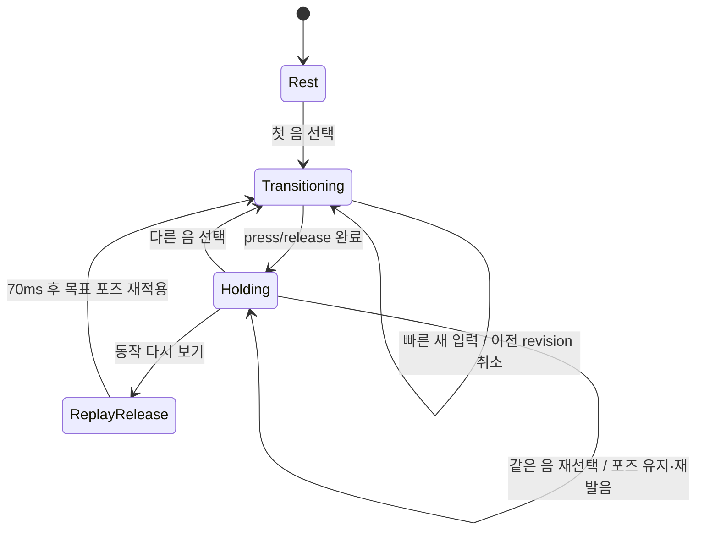
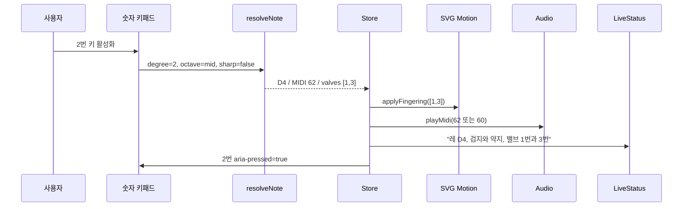

# 트럼펫 계이름 운지법 배우기 애니메이션 모바일 웹앱 개발서

| 항목 | 내용 |
|---|---|
| 문서 버전 | 2.0 |
| 작성일 | 2026-07-19 |
| 구현 목표 | 숫자 버튼 1–8을 누르면 해당 계이름의 표준 운지를 양손·피스톤 SVG 모션과 소리로 시연하는 모바일 웹앱 |
| 1차 산출물 | 오프라인에서 실행되는 자기완결형 `index.html` 1개 |
| 기준 화면 | 모바일 세로 390×844px, 최소 지원 폭 320px |
| 지원 음역 | B♭ 트럼펫 기보음 F♯3–C6, MIDI 54–84, 총 31음 |
| 데이터 기준 | `output/trumpet-fingering-chart-hand.html`의 검증된 `NOTES` 배열 |
| SVG 기준 | `output/trumpet-fingering-chart-hand.html`의 `#trumpet-scene` |
| 참고 문서 | 루트 `트럼펫 계이름 운지법 애니메이션 웹앱 개발서.md` |

> 이 문서는 기존 개발서의 실행 사양을 `output`의 실제 HTML·SVG·PDF와 다시 맞춘 구현 기준서다. 충돌 시 이 문서의 31음 데이터와 ID 계약을 우선한다.

---

## 0. 가장 먼저 고정할 제품 결정

1. **숫자 1–8은 밸브 번호가 아니라 음계의 차수**다. 기본 옥타브에서 `1=도`, `2=레`, `3=미`, `4=파`, `5=솔`, `6=라`, `7=시`, `8=높은 도`다.
2. 실제 음은 `숫자 버튼 + 옥타브 + ♯ 상태`로 결정한다. 계이름 문자열만으로 운지를 찾지 않고, 반드시 고유한 `midi`로 `NOTES`를 조회한다.
3. **오른손 검지·중지·약지만 밸브를 누른다.** 검지=1번, 중지=2번, 약지=3번이다. 오른손 엄지·소지는 파지 기준점으로 유지한다.
4. **왼손은 항상 악기를 지지한다.** 기본 운지 전환 중에는 흔들리지 않는다. 저음의 1-3 또는 1-2-3에서만 선택적으로 왼손 약지와 3번 슬라이드를 함께 움직인다.
5. 숫자 버튼의 눌림 효과는 손을 떼면 끝나지만, 트럼펫의 목표 운지 자세는 다음 음을 선택할 때까지 유지한다. 학습자가 결과를 충분히 관찰할 수 있어야 한다.
6. 같은 숫자 버튼을 다시 누르면 같은 음을 다시 듣되 밸브 포즈는 유지한다. 실제 반복음은 같은 밸브를 유지한 채 혀로 발음할 수 있기 때문이다. 전체 손동작은 별도 **`운지 동작 다시 보기`** 버튼에서만 놓임→누름으로 교육 시연한다. 개방음은 어떤 경우에도 밸브를 거짓으로 누르지 않는다.
7. 세 밸브가 필요한 음은 순차가 아니라 **같은 프레임에 동시에** 누른다. 다른 음으로 바꿀 때 해제되는 비트는 올라가고 새 비트는 내려가며, 두 운지에 공통인 밸브는 계속 눌린 채 유지된다.
8. 기본 학습은 표준 주운지만 사용한다. 대체 운지는 `고급 운지` 옵션을 켰을 때만 선택할 수 있으며, 다음 음으로 이동하면 표준 운지로 되돌린다.
9. 계이름과 소리는 기보음 기준이 기본이다. `실음`을 선택하면 소리만 MIDI −2로 재생하고, 화면의 기보음·운지 데이터는 바꾸지 않는다.
10. 애니메이션은 설명 장식이 아니라 정답 정보다. `prefers-reduced-motion`에서는 이동을 즉시 적용하되 텍스트·색·굵기로 동일한 정보를 제공한다.

---

## 1. 기준 자료 감사와 재사용 원칙

### 1.1 `output` 자료별 역할

| 파일 | 확인된 역할 | 새 앱에서 재사용할 것 | 그대로 복제하지 않을 것 |
|---|---|---|---|
| `trumpet-fingering-chart-hand.html` | 31음 선택형 인터랙티브 차트, 양손·트럼펫 씬, Web Audio | `NOTES`, 디자인 토큰, 실제 SVG ID·좌표, 운지 클래스 토글, 기보음/실음 로직 | 31개 음표 버튼 그리드, 초기 D4 정적 대체운지 문구, oscillator 즉시 정지 방식 |
| `trumpet-fingering-chart-hand.svg` | A4 가로 31음 정적 운지표 | 미니 손의 눌림 표기, 인쇄 가독성, 계이름 표기 | 모바일 앱의 메인 레이아웃 |
| `pdf/trumpet-fingering-chart-hand.pdf` | 1페이지 A4 가로 배포본 | 인쇄 기준과 시각 QA 참고 | 런타임 자산 포함 |
| `trumpet-fingering-chart-vibe-coding-prompt-ko.md` | 손 해부학·SVG·데이터·QA 요구사항 | 손가락 접촉 조건, 8개 포즈, 오프라인·접근성·검증 기준 | 출력물 3종을 동시에 생성하는 범위 |

`scripts/validate_hand_fingering_chart.py`로 확인한 현재 기준선은 다음과 같다.

| 검사 | 결과 |
|---|---|
| 데이터 | 31음, MIDI 54–84, 대체 운지 10음·11조합 |
| 독립 SVG | 음 셀 31개, 미니 손 31개, 래스터 이미지 0개 |
| 인터랙티브 HTML | 음 버튼 31개, 초기 인덱스 8(D4), 외부 요청 0건 |
| PDF | A4 가로 1페이지, 841.8898×595.2756pt, 전체 페이지 래스터 아님 |

독립 SVG의 오선·음표 글리프를 재사용하면 SVG metadata와 화면 정보에 있는 Bravura의 SIL OFL 저작자 표시를 유지한다. 독립 SVG와 PDF는 인쇄 참고물이며 760×460 대형 인터랙티브 씬의 원본이 아니다.

### 1.2 기존 개발서에서 계승할 것

- 8버튼 키패드, 낮음/기본/높음 옥타브, ♯ 토글 구조
- 자유 연주·스케일·퀴즈의 3개 학습 모드 구상
- 기보음/실음 오디오, 햅틱 옵션, 모바일 우선 원칙
- 외부 라이브러리 없이 인라인 CSS·SVG·JavaScript로 만드는 자기완결 배포 방식

초기 화면은 `NOTES`로 렌더한 **2번 레 D4, 운지 1-3**을 보여 주되 자동으로 소리를 내지 않는다. HTML에 데이터를 중복 입력한 임시 문구를 먼저 표시했다가 스크립트로 고치지 않는다.

### 1.3 데이터 충돌 보정

현재 `output/trumpet-fingering-chart-hand.html`은 공식 자료 대조 후 다음 두 대체 운지를 제외한 상태다.

| 음 | 표준 운지 | 기존 개발서에 남아 있던 값 | 이 문서의 확정값 |
|---|---:|---:|---:|
| D4 | 1-3 | 대체 `3` | 대체 운지 없음 |
| F♯5/G♭5 | 2 | 대체 `1-3` | 대체 운지 없음 |

따라서 확정 데이터는 **31음, 대체 운지가 있는 음 10개, 대체 조합 11개**다. 앱·테스트·설명 문구 모두 부록 A와 일치해야 한다.

### 1.4 단일 진실 공급원

개발 중 데이터 원본은 하나만 둔다.

```text
NOTES 31개
  ├─ 숫자 버튼 해석
  ├─ 현재 음 카드
  ├─ 손가락·피스톤 포즈
  ├─ 대체 운지 선택
  ├─ 기보음/실음 재생
  └─ 퀴즈 정답 판정
```

HTML 문자열, SVG 클래스, 퀴즈 문제에 별도의 운지표를 복사하지 않는다.

---

## 2. 제품 범위와 사용자 경험

### 2.1 핵심 사용자 이야기

- 입문자는 숫자 1–8을 순서대로 눌러 도–레–미–파–솔–라–시–도를 듣고 올바른 오른손 운지를 본다.
- 학습자는 개방음에서 세 손가락이 모두 밸브 위에 놓이되 누르지 않는 모습을 분명히 구분한다.
- 학습자는 앞 음에서 누른 밸브가 다음 음에서 어떻게 놓이고 다른 밸브가 눌리는지 한 번의 자연스러운 전환으로 본다.
- 교사는 낮음·기본·높음 옥타브와 ♯을 선택해 같은 계이름이라도 옥타브에 따라 달라지는 운지를 비교한다.
- 접근성 사용자는 애니메이션을 보지 못해도 현재 음, 누르는 손가락, 밸브 조합을 텍스트와 스크린리더로 확인한다.

### 2.2 MVP에 포함

- 1–8 숫자 키패드와 각 버튼의 계이름 라벨
- 낮음/기본/높음 옥타브와 `변음 ♯/♭` 토글
- 현재 계이름·기보음·운지·손가락·실음 표시
- 양손·트럼펫 인라인 SVG, 8가지 밸브 포즈, 누름·해제 전환과 교육용 동작 다시 보기
- 기보음/실음 Web Audio, 음소거와 햅틱 옵션
- 배우기 모드와 자연장음계 순차 연습 모드
- 키보드·스크린리더·모션 감소·320px 반응형 지원

### 2.3 2차 범위

- 밸브를 직접 눌러 답하는 퀴즈
- 대체 운지 선택 및 비교
- 3번 밸브 슬라이드 교육 모션
- 학습 진도, 연속 정답, 로컬 저장
- 실제 트럼펫 샘플 또는 더 정교한 물리 모델 음원

### 2.4 범위 밖

- 마이크로 실제 연주 음정 판정
- 사용자 계정, 서버, 클라우드 동기화
- MIDI 장치 입력
- 래스터 손 사진 또는 외부 CDN 자산
- 실제 연주자의 손 크기·악기 모델별 정밀 생체역학 시뮬레이션

### 2.5 완료 성공 기준

- 숫자·옥타브·♯의 모든 활성 조합이 정확한 `midi`와 표준 운지를 반환한다.
- 8개 밸브 조합 `0, 1, 2, 3, 1-2, 1-3, 2-3, 1-2-3`을 모두 시각화한다.
- 누른 손가락과 해당 피스톤 캡이 같은 시작 시간과 방향으로 이동한다.
- 390×844px에서 가로 스크롤과 손·트럼펫 잘림 없이 주요 기능을 한 화면 흐름에서 쓸 수 있다.
- 빠른 연타, 같은 음 재입력, 음소거, 화면 회전, 백그라운드 복귀에서 콘솔 오류가 없다.
- 외부 네트워크 요청 0건으로 동작한다.

---

## 3. 음악 데이터와 숫자 버튼 계약

### 3.1 `Note` 스키마

```js
/** @typedef {Object} Note
 * @property {number} midi        기보음 MIDI, 54–84
 * @property {string} name        예: "F♯3"
 * @property {string|null} enh    예: "G♭3", 없으면 null
 * @property {string} solfege     예: "파♯ / 솔♭"
 * @property {number[]} valves    표준 운지, []는 개방
 * @property {number[][]} alts    검증된 대체 운지 목록
 * @property {string} concert     B♭ 트럼펫 실음 이름
 */
```

다음 조건을 빌드 시 검증한다.

```js
console.assert(NOTES.length === 31);
console.assert(NOTES[0].midi === 54 && NOTES.at(-1).midi === 84);
console.assert(NOTES.every((n, i) => n.midi === 54 + i));
console.assert(new Set(NOTES.map(n => n.midi)).size === 31);
console.assert(NOTES.every(n => n.valves.every(v => [1, 2, 3].includes(v))));
console.assert(NOTES.filter(n => n.alts.length).length === 10);
console.assert(NOTES.reduce((sum, n) => sum + n.alts.length, 0) === 11);
console.assert(NOTES.find(n => n.midi === 62).alts.length === 0); // D4
console.assert(NOTES.find(n => n.midi === 78).alts.length === 0); // F♯5
```

### 3.2 숫자 버튼 해석 함수

```js
const DEGREE_OFFSET = [0, 2, 4, 5, 7, 9, 11, 12];
const OCTAVE_BASE = { low: 48, mid: 60, high: 72 };
const SHARPABLE = [true, true, false, true, true, true, false, true];

function midiFor(buttonNumber, octave, sharpOn) {
  if (!Number.isInteger(buttonNumber) || buttonNumber < 1 || buttonNumber > 8) {
    return null;
  }
  let midi = OCTAVE_BASE[octave] + DEGREE_OFFSET[buttonNumber - 1];
  if (sharpOn) {
    if (!SHARPABLE[buttonNumber - 1]) return null;
    midi += 1;
  }
  return midi >= 54 && midi <= 84 ? midi : null;
}

function noteFor(buttonNumber, octave, sharpOn) {
  const midi = midiFor(buttonNumber, octave, sharpOn);
  return midi === null ? null : NOTES.find(note => note.midi === midi) ?? null;
}
```

`OCTAVE_BASE[octave]`가 없는 경우 예외가 나지 않도록 실제 구현에서는 옥타브 값을 먼저 검증한다. `null`은 음역 밖 또는 지원하지 않는 ♯ 버튼이라는 뜻이다.

### 3.3 전체 버튼 매핑

| 버튼 | 낮음 | 낮음+♯ | 기본 | 기본+♯ | 높음 | 높음+♯ |
|---:|---|---|---|---|---|---|
| 1 | 비활성 C3 | 비활성 C♯3 | 도 C4 · 0 | 도♯ C♯4 · 1-2-3 | 도 C5 · 0 | 도♯ C♯5 · 1-2 |
| 2 | 비활성 D3 | 비활성 D♯3 | 레 D4 · 1-3 | 레♯ D♯4 · 2-3 | 레 D5 · 1 | 레♯ D♯5 · 2 |
| 3 | 비활성 E3 | 비활성 | 미 E4 · 1-2 | 비활성 | 미 E5 · 0 | 비활성 |
| 4 | 비활성 F3 | 파♯ F♯3 · 1-2-3 | 파 F4 · 1 | 파♯ F♯4 · 2 | 파 F5 · 1 | 파♯ F♯5 · 2 |
| 5 | 솔 G3 · 1-3 | 솔♯ G♯3 · 2-3 | 솔 G4 · 0 | 솔♯ G♯4 · 2-3 | 솔 G5 · 0 | 솔♯ G♯5 · 2-3 |
| 6 | 라 A3 · 1-2 | 라♯ A♯3 · 1 | 라 A4 · 1-2 | 라♯ A♯4 · 1 | 라 A5 · 1-2 | 라♯ A♯5 · 1 |
| 7 | 시 B3 · 2 | 비활성 | 시 B4 · 2 | 비활성 | 시 B5 · 2 | 비활성 |
| 8 | 도 C4 · 0 | 도♯ C♯4 · 1-2-3 | 도 C5 · 0 | 도♯ C♯5 · 1-2 | 도 C6 · 0 | 비활성 C♯6 |

### 3.4 버튼 표시 규칙

각 버튼은 세 줄을 사용한다.

```html
<button class="degree-key" data-degree="2" aria-label="2번 레, D4, 밸브 1번과 3번">
  <span class="degree-number">2</span>
  <span class="degree-solfege">레</span>
  <span class="degree-pitch">D4</span>
</button>
```

- 가장 큰 값: 숫자, 최소 24px
- 두 번째: 계이름, 최소 16px
- 세 번째: 음이름, 최소 12px
- 1번은 `도`, 8번은 `도⁺`로 시각 구분하고 접근성 라벨은 각각 `도`, `위 도`로 읽는다.
- 선택 버튼: `aria-pressed="true"`, 골드 테두리, 안쪽 하이라이트
- 비활성 버튼: 실제 `disabled`, `aria-disabled="true"`, 대비를 유지한 55% 불투명도
- 비활성 이유는 버튼 인접 설명 또는 포커스 가능한 도움말에 `지원 음역 밖`/`미♯·시♯은 이 학습 단계에서 제외`로 표시한다. 미♯·시♯은 음악 이론상 존재하지만, 이 초급 UI에서는 F·C와의 이명동음 중복을 피하려고 제공하지 않는 것이다.
- 화면 라벨은 단순 `♯`보다 `변음 ♯/♭`을 사용한다. 토글을 켜도 버튼 번호는 바뀌지 않고 계이름·음이름·접근성 라벨만 다시 렌더한다.

### 3.5 대체 운지 계약

- `activeValves = selectedAlt === null ? note.valves : note.alts[selectedAlt]`로 한 곳에서 결정한다.
- `selectedAlt`는 밸브 배열 자체가 아니라 대체 운지 인덱스 또는 `null`로 저장한다.
- 기본/스케일/기본 퀴즈는 주운지만 사용한다.
- 고급 퀴즈에서만 `note.valves`와 `note.alts`를 모두 정답으로 인정할 수 있다.
- 대체 운지를 선택해도 `midi`, 계이름, 재생 주파수는 바뀌지 않는다.

---

## 4. 모바일 정보 구조와 화면 설계

### 4.1 390×844px 기준 세로 흐름

```text
┌──────────────────────────────────┐
│ 제목 · 음소거 · 설정        52px │
├──────────────────────────────────┤
│ 현재 음: 레  D4                  │
│ 검지+약지 · 밸브 1-3        78px │
├──────────────────────────────────┤
│                                  │
│      트럼펫 + 양손 SVG           │
│                                  │
│                            246px │
├──────────────────────────────────┤
│ 배우기     스케일  퀴즈      44px │
│ 낮음       기본      높음    44px │
│ ♯  고급운지  기보음/실음     44px │
├──────────────────────────────────┤
│  [1 도] [2 레] [3 미] [4 파]     │
│  [5 솔] [6 라] [7 시] [8 도]     │
│                     2×4, 152px  │
└──────────────────────────────────┘
       하단 safe-area 포함
```

화면 높이가 740px 이하이면 다음 순서로 축소한다.

1. SVG 카드의 내부 여백을 줄여 높이를 210px까지 축소한다.
2. 보조 설명 한 줄을 접고 `자세히`에서 연다.
3. 키패드 버튼 높이는 60px에서 52px까지만 줄인다.
4. 터치 타겟 44×44px와 현재 음 정보는 절대 제거하지 않는다.

### 4.2 컴포넌트

| 컴포넌트 | 책임 | 주요 상태/속성 |
|---|---|---|
| `AppHeader` | 제목, 음소거, 설정 | `soundOn`, `hapticOn` |
| `CurrentNoteCard` | 계이름·음이름·운지·손가락·실음 | `currentNote`, `activeValves` |
| `TrumpetScene` | 트럼펫·양손 포즈와 모션 | `poseKey`, `motionRevision` |
| `ReplayMotionButton` | 현재 운지의 교육용 놓임→누름 시연 | `현재 운지 다시 보기` |
| `ModeTabs` | 배우기/스케일/퀴즈 | `mode` |
| `OctaveControl` | 낮음/기본/높음 | `octave` |
| `SharpToggle` | 자연음/변음 ♯·♭ | `sharpOn` |
| `PitchModeControl` | 기보음/실음 재생 | `pitchMode` |
| `DegreeKeypad` | 1–8 선택 | 파생된 `keyModels[8]` |
| `AltFingeringPicker` | 검증된 대체 운지 선택 | `selectedAlt` |
| `LiveStatus` | 스크린리더 알림 | 렌더된 짧은 문장 |

설정 아이콘을 넣으면 실제 `<dialog>`를 구현해 소리, 햅틱, 슬라이드 교육 모션, 고급 운지를 제공한다. 열 때 첫 설정으로 포커스를 보내고, `Escape`와 닫기 버튼으로 닫으며, 닫은 뒤 설정 아이콘으로 포커스를 돌려준다. 이 동작을 구현하지 않을 경우 MVP 헤더에서 설정 아이콘을 제거한다.

### 4.3 반응형 규칙

| 폭 | 레이아웃 |
|---|---|
| 320–599px | 한 열. SVG 위, 컨트롤과 4×2 키패드 아래 |
| 600–899px | SVG와 현재 음 카드를 상단 2열, 키패드 4×2 전폭 |
| 900px 이상 | 최대 폭 960px. 왼쪽 SVG, 오른쪽 정보·컨트롤·키패드 |

- `<meta name="viewport" content="width=device-width,initial-scale=1,viewport-fit=cover">`를 사용한다.
- 루트에 `min-height: 100dvh`를 사용하고 폴백으로 `100vh`를 둔다.
- 상·하단 여백은 `env(safe-area-inset-top/bottom)`을 더한다.
- SVG는 `width:100%; height:auto; aspect-ratio:760/460`을 유지한다.
- 599px 이하의 키패드는 문서 흐름 안에서 `position:sticky; bottom:0`으로 유지하고 불투명 배경과 하단 safe-area 패딩을 둔다. 키패드가 본문을 가리지 않게 동일 높이의 여유를 확보한다.
- 600px 이상 가로 모드에서 키패드는 오른쪽 열의 2열×4행으로 바꾸되 DOM 읽기 순서는 현재 음 → SVG → 컨트롤 → 키패드로 유지한다.
- 페이지 수준 `overflow-x:hidden`으로 문제를 덮지 말고 모든 자식 폭을 바로잡아 가로 overflow를 0으로 만든다.
- 200% 글자 확대 시 고정 높이를 해제하고 세로 스크롤을 허용한다.

### 4.4 선택과 유지의 시각 규칙

- 키를 누르는 동안: 키패드가 2px 아래로 이동하고 그림자가 줄어든다.
- 손가락 모션 완료 후: 목표 운지는 그대로 유지된다.
- 이전 음에서 풀리는 밸브: 170ms 동안 위로 복귀한다.
- 새로 눌리는 밸브: 120ms 동안 아래로 이동한다.
- 현재 음 카드와 키패드 선택 표시는 포즈 전환 시작 프레임에 함께 갱신한다.
- 음이 끝나도 운지는 풀지 않는다. 운지 학습과 소리 지속시간을 결합하지 않는다.

---

## 5. 양손·트럼펫 SVG 설계 계약

### 5.1 기준 좌표와 방향

- `viewBox="0 0 760 460"`
- 관객 시점의 측면도: 벨은 왼쪽, 마우스피스는 오른쪽
- 화면상 밸브 순서: 왼쪽부터 3번, 2번, 1번
- 캡 중심: 3번 `(320,165)`, 2번 `(385,165)`, 1번 `(450,165)`
- 피스톤 눌림 이동량: `translateY(14px)`
- 오른손 손가락 피벗: 약지 `(525,101)`, 중지 `(550,88)`, 검지 `(575,105)`
- 손가락 끝은 휴지 상태에서 각 캡 위쪽에 닿거나 0–3px 이내로 떠 있어야 한다.

### 5.2 DOM ID와 레이어 순서

기존 `output`과 호환되는 바깥 ID를 보존하고, 해부학을 개선할 때 그 안에 관절 그룹을 추가한다.

```text
#trumpet-scene
├─ #scene-background
├─ #scene-left-hand-back
├─ #scene-trumpet
│  ├─ #scene-bell
│  ├─ #scene-main-tube
│  ├─ #scene-tuning-slide
│  ├─ #scene-valve-casings
│  ├─ #scene-slide-3
│  ├─ #scene-valve-3.scene-valve[data-valve="3"]
│  ├─ #scene-valve-2.scene-valve[data-valve="2"]
│  └─ #scene-valve-1.scene-valve[data-valve="1"]
├─ #scene-left-hand
│  ├─ #scene-lh-palm
│  ├─ #scene-lh-thumb
│  ├─ #scene-lh-grip-fingers
│  └─ #scene-lh-ring
├─ #scene-right-hand
│  ├─ #scene-rh-palm
│  ├─ #scene-rh-thumb
│  ├─ #scene-rh-pinky
│  ├─ #scene-finger-ring.scene-finger[data-valve="3"]
│  │  ├─ .finger-proximal
│  │  ├─ .finger-middle
│  │  ├─ .finger-distal
│  │  └─ .finger-pad
│  ├─ #scene-finger-middle.scene-finger[data-valve="2"]
│  └─ #scene-finger-index.scene-finger[data-valve="1"]
└─ #scene-labels
```

왼손이 악기를 감싸는 깊이를 표현하려면 손등·손목 일부를 `#scene-left-hand-back`으로 악기보다 먼저 그리고, 손가락과 손바닥 전면은 기존 호환 ID `#scene-left-hand`로 악기 뒤에 그린다. 전체 레이어는 왼손 후면 → 트럼펫 → 왼손 전면 → 오른손 손바닥 → 움직이는 세 손가락 → 안내 라벨 순이다. 피스톤 캡과 손끝의 가림은 캡이 손가락 위를 뚫고 보이지 않도록 실제 접촉 부위에서 확인한다.

### 5.3 오른손 해부학

- 검지, 중지, 약지는 동일한 막대 3개가 아니라 길이·굵기·곡률이 달라야 한다.
- 중지가 가장 길고, 검지는 약간 짧으며, 약지는 검지보다 가늘고 굽힘이 조금 크다.
- 각 손가락에 최소 두 개의 관절 주름, 손끝 패드, 얕은 하이라이트를 둔다.
- 손바닥에서 손가락이 시작하는 위치가 겹치지 않으며, 세 손가락 path가 서로 교차하지 않는다.
- 엄지는 1·2번 케이싱 사이 아래를 받치고, 소지는 핑거 후크에 둔다. 두 부위는 운지 전환 때 움직이지 않는다.
- 누른 상태의 손끝 패드 중심과 해당 캡 중심의 X 오차는 3px 이하여야 한다.
- 손가락은 캡과 함께 내려가며 관이나 케이싱을 관통하지 않는다.

#### 5.3.1 모션 정밀도 단계

| 단계 | 구현 | 사용 조건 |
|---|---|---|
| 기준 이식 | 현재 `output`처럼 손가락 전체 그룹을 피벗에서 회전 | 8포즈 접촉 검사가 모두 3px 이내일 때만 MVP 허용 |
| 정밀 리그 | MCP/PIP/DIP 중첩 관절과 손끝 접촉 앵커를 사용 | 손 path를 정교화하거나 기준 이식이 접촉 검사에 실패하면 필수 |

정밀 리그의 구조는 다음과 같다.

```text
.finger-rig
└─ .joint-mcp
   ├─ .segment-proximal
   └─ .joint-pip
      ├─ .segment-middle
      └─ .joint-dip
         ├─ .segment-distal
         ├─ .finger-pad
         ├─ .nail
         └─ .contact-anchor
```

세그먼트는 관절에서 5–8px 겹쳐 회전 중 틈이 생기지 않게 한다. 관절 회전축은 CSS bounding box 기반 `transform-origin`에 의존하지 않고 중첩 `<g transform="matrix(...)"` 또는 동등한 SVG 행렬을 사용한다. 정밀 리그도 휴지·눌림의 최종 손끝 위치와 외곽 실루엣은 현재 `output` 장면을 보존해야 한다.

기존 실루엣을 관절로 나눌 때의 초기 캘리브레이션 값은 다음과 같다. 최종값이 아니라 접촉 해를 찾기 위한 시작점이며, 캡 중심과 14px 이동량은 바꾸지 않고 링크 길이·기본각만 보정한다.

| 손가락 | 밸브 | MCP 루트 | 근위/중위/원위 투영 길이 |
|---|---:|---:|---:|
| 검지 | 1 | `(575,105)` | `58 / 52 / 32` |
| 중지 | 2 | `(550,88)` | `70 / 67 / 48` |
| 약지 | 3 | `(525,101)` | `78 / 82 / 58` |

정밀 리그의 접촉 계산은 33개 샘플 각각 오차 0.75px 이하를 목표로 하고, 최종 렌더 캡처는 손끝–캡 거리 1.5px 이하와 수평 이탈 2px 이하를 통과해야 한다. 이보다 큰 경우 해당 포즈를 빌드 실패로 처리한다.

### 5.4 왼손 파지와 3번 슬라이드

- 왼손 손바닥은 밸브 케이싱 아래·뒤를 감싸 악기의 무게를 지지한다.
- 왼손 엄지는 1번 밸브 케이싱 주변에, 나머지 파지 손가락은 3번 케이싱 주변에 자연스럽게 둔다.
- `#scene-lh-ring`의 손가락 끝은 3번 밸브 슬라이드 링 안쪽과 겹친다.
- 기본값은 슬라이드 모션 꺼짐이다. 켜면 `#scene-slide-3`과 `#scene-lh-ring`을 같은 220ms에 `translateX(-14px)` 한다.
- 위 translate 방식은 기준 이식 단계의 구현이다. 정밀 리그에서는 왼손 약지 MCP 루트를 손바닥에 고정하고 PIP/DIP 각도만 바꿔 손끝이 이동한 링을 따라가게 하며, MCP 루트 이동 오차를 0.5px 이하로 제한한다.
- 슬라이드 표시 여부는 밸브 조합만으로 추론하지 않고 음별 교육 데이터로 관리하는 것이 최종안이다. MVP에서 `output` 동작을 그대로 계승한다면 임시 규칙은 다음과 같다.

```js
const needsSlide = note.midi <= 62
  && activeValves.includes(1)
  && activeValves.includes(3);
```

이 규칙은 F♯3, G3, C♯4, D4에 시각 힌트를 준다. 이는 정밀 음정 보정량을 계산하는 모델이 아니므로 UI에 `저음 음정 보정 예시`로 명시하고, 교사 검수 후 음별 `slide3Hint` 필드로 대체한다.

### 5.5 8개 포즈

| 포즈 키 | 밸브 | 움직이는 오른손 | 피스톤 상태 |
|---|---|---|---|
| `000` | 0, 개방 | 없음 | 모두 위 |
| `100` | 1 | 검지 | 1번 아래 |
| `010` | 2 | 중지 | 2번 아래 |
| `001` | 3 | 약지 | 3번 아래 |
| `110` | 1-2 | 검지+중지 | 1·2번 아래 |
| `101` | 1-3 | 검지+약지 | 1·3번 아래 |
| `011` | 2-3 | 중지+약지 | 2·3번 아래 |
| `111` | 1-2-3 | 검지+중지+약지 | 모두 아래 |

```js
const poseKey = valves => [1, 2, 3]
  .map(v => valves.includes(v) ? "1" : "0")
  .join("");
```

대체 운지 때문에 `001` 포즈도 반드시 구현한다. 표준 주운지만 보면 놓치기 쉬운 포즈다.

### 5.6 SVG 품질 제한

- 손 전체는 SVG path·ellipse·gradient로 만들고 래스터 이미지를 삽입하지 않는다.
- 반복되는 고유 ID를 만들지 않는다. 미니 아이콘을 추가하면 ID 없는 마크업 또는 `<symbol>`/`<use>`를 사용한다.
- 런타임 모션 속성은 `transform`, `fill`, `stroke`, `opacity`로 제한한다.
- 고비용 blur/filter는 큰 정적 그룹에만 한 번 적용하며 움직이는 각 손가락에 별도 필터를 중첩하지 않는다.
- 정밀 리그에서는 현재 출력의 `#scene-right-hand filter="url(#hand-shadow)"`를 정적 그림자 path로 바꿔, 움직이는 관절의 상위 그룹이 매 프레임 다시 래스터화되지 않게 한다.
- SVG의 `viewBox`는 바꾸지 않는다. 좌표계를 바꾸면 이 문서의 모든 피벗·캡·접촉점 테스트를 다시 산출한다.

---

## 6. 모션 시스템

### 6.1 상태 모델



`Holding`은 소리가 끝난 뒤에도 유지한다. 모션과 오디오 수명을 분리한다.

### 6.2 시간과 이징

| 대상 | 시작 | 지속 | 이징 | 결과 |
|---|---:|---:|---|---|
| 새로 누르는 피스톤 | 0ms | 120ms | `cubic-bezier(.3,0,.2,1)` | Y +14px |
| 새로 누르는 손가락 | 0ms | 120ms | 피스톤과 동일 | 캡 접촉 유지 |
| 놓는 피스톤 | 0ms | 170ms | `cubic-bezier(.34,1.3,.3,1)` | Y 0px |
| 놓는 손가락 | 0ms | 170ms | 피스톤과 동일 | 휴지 위치 |
| 3번 슬라이드·왼손 약지 | 20ms | 220ms | `ease-out` | X −14px |
| 현재 음 카드 교체 | 0ms | 120ms | `ease-out` | opacity .65→1 |
| 교육용 동작 다시 보기의 놓임 | 0ms | 70ms | `ease-out` | 활성 손가락만 휴지 위치 |

누름과 해제에 다른 CSS 규칙을 적용하려면 `.pressed`가 없는 상태에 긴 release transition을 지정한다.

```css
.scene-valve,
.scene-finger {
  transition: transform 120ms cubic-bezier(.3, 0, .2, 1);
  will-change: transform;
}

.scene-valve:not(.pressed),
.scene-finger:not(.pressed) {
  transition-duration: 170ms;
  transition-timing-function: cubic-bezier(.34, 1.3, .3, 1);
}

.scene-valve.pressed { transform: translateY(14px); }
.scene-valve circle {
  transition: fill 120ms ease, stroke 120ms ease;
}
#scene-finger-index  { transform-origin: 575px 105px; }
#scene-finger-middle { transform-origin: 550px 88px; }
#scene-finger-ring   { transform-origin: 525px 101px; }
#scene-finger-index.pressed  { transform: rotate(-8deg); }
#scene-finger-middle.pressed { transform: rotate(-5deg); }
#scene-finger-ring.pressed   { transform: rotate(-4deg); }
```

위 회전값은 현재 `output` 좌표용 시작값이다. 손 path를 정교화하면 손끝 패드 중심과 캡 중심을 렌더 좌표로 측정해 다시 보정한다. 눈대중으로 각도를 유지하지 않는다.

### 6.3 포즈 적용과 빠른 연타

```js
const valvesByNumber = {
  1: document.querySelector('#scene-valve-1'),
  2: document.querySelector('#scene-valve-2'),
  3: document.querySelector('#scene-valve-3')
};
const fingersByNumber = {
  1: document.querySelector('#scene-finger-index'),
  2: document.querySelector('#scene-finger-middle'),
  3: document.querySelector('#scene-finger-ring')
};

let motionRevision = 0;
let heldPoseKey = '000';

function setPoseImmediately(valves) {
  const active = new Set(valves);
  for (const number of [1, 2, 3]) {
    const pressed = active.has(number);
    valvesByNumber[number].classList.toggle('pressed', pressed);
    fingersByNumber[number].classList.toggle('pressed', pressed);
  }
  heldPoseKey = poseKey(valves);
}

function applyFingering(valves) {
  ++motionRevision;
  const nextKey = poseKey(valves);
  if (nextKey === heldPoseKey) return; // 같은 음의 실제 반복: 포즈 유지
  setPoseImmediately(valves);
}

function replayFingering(valves) {
  const revision = ++motionRevision;
  const nextKey = poseKey(valves);
  if (nextKey === '000') {
    pulseOpenBadge(); // 개방음에 거짓 누름을 만들지 않음
    return;
  }

  // 명시적 교육 시연에서만 활성 손가락을 놓았다 다시 누른다.
  setPoseImmediately([]);
  window.setTimeout(() => {
    if (revision !== motionRevision) return;
    requestAnimationFrame(() => {
      if (revision === motionRevision) setPoseImmediately(valves);
    });
  }, 70);
}
```

- `motionRevision`은 오래된 교육 시연 타이머가 새 입력을 덮지 못하게 한다.
- `setPoseImmediately`의 한 루프에서 손가락과 피스톤 클래스를 모두 갱신한다.
- 연속 입력 때 애니메이션 큐를 쌓지 않는다. 현재 computed transform에서 새 목표로 자연스럽게 전환한다.
- `[1,3]→[2,3]`처럼 공통 밸브가 있으면 3번은 계속 누른 채, 1번 해제와 2번 누름만 같은 프레임에 시작한다.
- `transitionend`를 핵심 상태 변경 트리거로 사용하지 않는다. 이벤트가 누락되어도 앱 상태가 멈추지 않아야 한다.

#### 정밀 리그의 공유 진행도

정밀 리그에서는 밸브별 진행도 `p∈[0,1]` 하나를 피스톤과 손가락 관절이 공유한다. 피스톤은 `translateY(14p)`이고 손끝 접촉 목표는 다음과 같다.

```js
function valveContactTarget(number, progress) {
  const cap = {
    1: { cx: 450, cy: 165, r: 18 },
    2: { cx: 385, cy: 165, r: 18 },
    3: { cx: 320, cy: 165, r: 18 }
  }[number];
  return {
    x: cap.cx,
    y: cap.cy - cap.r + 14 * progress + 1 // 패드 1px 겹침
  };
}
```

런타임에서 역기구학을 매 프레임 풀지 않는다. 빌드 또는 초기화 때 각 손가락의 `p=0..1`을 32등분한 33개 MCP/PIP/DIP 포즈를 계산하고, 런타임에는 인접 포즈를 보간한다. 모든 채널은 같은 `performance.now()`를 받아 시작하며, 진행 중 새 입력이 오면 현재 `p`에서 새 목표로 재지정한다. 정밀 엔진도 최종 `.pressed`/`poseKey`를 논리적 진실로 유지한다.

정밀 엔진은 하나의 공유 `requestAnimationFrame`만 사용하고 모든 채널이 목표에 도달하면 즉시 종료한다. 프레임 루프 안에서는 `getBBox()`, `getBoundingClientRect()`, `getComputedStyle()` 또는 IK 계산을 실행하지 않는다.

### 6.4 손가락–캡 접촉 검증

각 손가락의 `.finger-pad`에 `data-tip` 기준점을 두고, 각 캡에도 `data-cap-center` 기준점을 둔다. 개발용 검사에서는 `getScreenCTM()`으로 화면 좌표를 얻는다.

```js
function svgPointToScreen(svg, element, x, y) {
  const point = new DOMPoint(x, y);
  return point.matrixTransform(element.getScreenCTM());
}
```

포즈별 합격 조건:

- 눌린 손끝 패드 중심과 캡 중심의 수평 오차 ≤ 3px
- 손끝 아래와 캡 위 사이의 시각적 공백 ≤ 3px
- 해당 피스톤과 손끝의 최종 세로 이동량 차이 ≤ 3px
- 놓인 손가락이 캡 내부 또는 관을 관통하지 않음
- 세 손가락 동시 포즈에서도 손가락끼리 역전·교차하지 않음

### 6.5 모션 감소

```css
@media (prefers-reduced-motion: reduce) {
  .scene-valve,
  .scene-finger,
  #scene-slide-3,
  #scene-lh-ring {
    transition: none !important;
  }
}
```

JavaScript에서도 `matchMedia('(prefers-reduced-motion: reduce)').matches`이면 교육용 다시 보기의 70ms 해제 단계를 생략하고 목표 포즈를 즉시 유지한다.

---

## 7. 입력 이벤트와 상태 관리

### 7.1 앱 상태

```js
const state = {
  mode: 'learn',              // learn | scale | quiz
  octave: 'mid',              // low | mid | high
  sharpOn: false,
  selectedDegree: 2,
  currentMidi: 62,
  selectedAlt: null,
  pitchMode: 'written',       // written | concert
  soundOn: true,
  hapticOn: true,
  slideMotionOn: false,
  quiz: { targetMidi: null, tries: 0, score: 0 },
  scale: { expectedDegree: 1 },
  motionRevision: 0
};
```

파생값인 `currentNote`, `activeValves`, `poseKey`, 8개 버튼의 disabled 여부를 상태에 중복 저장하지 않는다.

### 7.2 입력 파이프라인



### 7.3 포인터·키보드 처리

- 실제 `<button>`의 `click`을 유일한 의미상 활성화 이벤트로 사용한다. 이 방식은 터치·마우스·Enter·Space를 함께 지원한다.
- `pointerdown/up/cancel`은 키가 눌리는 외형에만 선택적으로 사용하고 음·모션 로직을 실행하지 않는다. 스크롤 시작이나 포인터 취소가 학습 음을 잘못 실행해서는 안 된다.
- CSS에 `touch-action: manipulation`과 `-webkit-tap-highlight-color: transparent`를 적용한다.
- 멀티터치는 마지막 유효 입력이 승리한다. 트럼펫은 단음 악기로 취급해 화음을 만들지 않는다.
- 데스크톱 `KeyboardEvent.code`의 `Digit1`–`Digit8`은 계이름 키, `ArrowUp/Down`은 옥타브, `KeyS`는 ♯ 토글, `Space`는 현재 음 다시 듣기, `KeyR`은 운지 동작 다시 보기다.
- 텍스트 입력 요소에 포커스가 있을 때 전역 단축키를 가로채지 않는다.

```js
function activateDegree(degree, inputKind = 'pointer') {
  const note = noteFor(degree, state.octave, state.sharpOn);
  if (!note) return announceDisabledReason(degree);

  state.selectedDegree = degree;
  state.currentMidi = note.midi;
  state.selectedAlt = null;
  renderState();
  applyFingering(note.valves);
  if (state.soundOn) playNote(note.midi, state.pitchMode);
  if (state.hapticOn && inputKind === 'pointer') safeVibrate(10);
  announceNote(note, note.valves);
}
```

### 7.4 옥타브·♯ 변경

컨트롤 변경 뒤 현재 숫자가 비활성이라면 자동으로 임의 음으로 점프하지 않는다.

1. 8개 키의 라벨과 disabled 상태를 다시 계산한다.
2. 현재 키가 계속 유효하면 새 상태의 같은 숫자로 음을 전환한다.
3. 현재 키가 무효면 `currentMidi=null`로 두고 `활성 숫자를 선택하세요`를 표시한다.
4. 가장 가까운 음으로 자동 선택하는 기능은 별도 사용자 설정이 없는 한 구현하지 않는다.

컨트롤 변경으로 생긴 포즈 전환에는 소리와 햅틱을 실행하지 않는다. 사용자가 숫자 키나 `다시 듣기`를 명시적으로 활성화해야만 소리가 난다.

---

## 8. 오디오·햅틱 설계

### 8.1 음높이

```js
function playbackMidi(noteMidi, pitchMode) {
  return pitchMode === 'concert' ? noteMidi - 2 : noteMidi;
}

function midiToHz(midi) {
  return 440 * Math.pow(2, (midi - 69) / 12);
}
```

- 기보음 모드: C4는 261.63Hz
- 실음 모드: 기보 C4를 B♭3, 약 233.08Hz로 재생
- UI의 계이름·운지·기보 음이름은 실음 모드에서도 유지하고, `실제 소리 B♭3`만 별도 표시한다.

### 8.2 Web Audio 그래프

```text
sawtooth(f) ─────────┐
                     ├─ lowpass(f×5.2, Q=.8) ─ gain envelope ─ destination
sine(2f) ─ gain(.10) ┘
```

- 첫 사용자 제스처에서 `AudioContext`를 만들거나 `resume()`한다.
- attack 35ms, 짧은 decay 뒤 sustain 약 .16, 780ms부터 release, 총 1.25s 이내
- 새 음이 시작되면 직전 음을 즉시 `stop()`하지 말고 40–50ms 페이드해 클릭 노이즈를 막는다.
- 오래된 oscillator 참조는 종료 후 배열에서 제거한다.
- Web Audio가 없거나 iOS 무음 환경이어도 UI·SVG 학습 기능은 정상 동작한다.
- 이 합성음은 음높이 확인용이다. `실제 트럼펫 음색`으로 과장해 설명하지 않는다.

### 8.3 모션과 오디오 동기

- `applyFingering`와 gain attack 예약을 같은 입력 핸들러에서 실행한다.
- 오디오 시작 지연을 인위적으로 120ms 뒤로 미루지 않는다. 손이 내려가기 시작하는 시점과 발음 시작이 체감상 일치해야 한다.
- 같은 숫자 재입력은 포즈를 유지한 채 즉시 새 attack을 시작한다. `운지 동작 다시 보기`는 시각 교육 동작이며 기본값에서는 자동으로 소리를 내지 않는다.

### 8.4 햅틱

```js
function safeVibrate(ms) {
  if ('vibrate' in navigator) navigator.vibrate(ms);
}
```

햅틱은 10ms 한 번만 사용하며 퀴즈 오답·정답에 긴 패턴을 기본 적용하지 않는다. 사용자가 끌 수 있어야 한다.

---

## 9. 학습 모드

### 9.1 배우기(자유 연주) — MVP 필수

숫자 키 선택 즉시 현재 음, 운지, 양손 모션, 소리를 제공한다. 옥타브·♯·기보음/실음·대체 운지를 자유롭게 바꿀 수 있다.

### 9.2 스케일 연습 — MVP 필수

- 진입 시 기본 옥타브, 자연음, 표준 운지로 설정한다.
- 기대 순서는 1→2→3→4→5→6→7→8이다.
- 다음 키는 골드 윤곽과 `다음` 텍스트로 안내한다. 색과 펄스에만 의존하지 않는다.
- 맞는 키: 모션·소리 후 다음 차수로 이동한다.
- 다른 키: 그 음도 정상 재생하되 진행도는 올리지 않고 `다음은 3번 미입니다`처럼 알려 준다.
- 8번까지 완료하면 8개 음을 500ms 간격으로 한 번 자동 시연한다. 자동 시연 중 사용자 입력이 오면 즉시 취소한다.

### 9.3 운지 퀴즈 — 2차

- 문제 카드에 계이름과 음이름을 표시하고 운지 텍스트는 숨긴다.
- 키패드 대신 세 밸브를 답안으로 토글한다. SVG `<g>` 자체만 클릭 요소로 쓰지 않고, 캡 위에 정렬한 44px 이상의 실제 HTML `<button aria-pressed>` 3개를 제공해 키보드·터치·스크린리더 입력을 모두 지원한다.
- `확인`을 누르면 순서를 무시한 밸브 집합으로 판정한다.
- 기본 난이도는 주운지만 정답, 고급 난이도는 검증된 대체 운지도 정답이다.
- 오답은 240ms의 작은 좌우 흔들림과 텍스트를 제공하고, 정답 포즈를 1.5s 시연한다.
- 정답은 골드 윤곽 2회, 정답 음 재생, 다음 문제로 진행한다.
- 최근 문제와 같은 MIDI는 연속 출제하지 않는다.

### 9.4 모드 전환 안전 규칙

- 자동 재생, 동작 다시 보기 타이머, 퀴즈 지연은 모드 전환 시 모두 취소한다.
- 자유 모드로 돌아올 때 마지막 수동 선택 음을 복구하거나 C4로 초기화하는 정책을 한 가지로 고정한다. 권장값은 마지막 수동 선택 복구다.
- 퀴즈 답안용 임시 밸브 상태는 실제 `currentNote`의 학습 포즈와 별도 상태로 관리한다.

---

## 10. 코드 구조

### 10.1 개발 중 파일 구조

```text
app/
├─ index.html
├─ src/
│  ├─ notes.js          # NOTES와 검증
│  ├─ mapping.js        # midiFor, noteFor, keyModels
│  ├─ store.js          # 상태와 액션
│  ├─ scene.js          # SVG 포즈·모션·접촉 디버그
│  ├─ audio.js          # Web Audio 생명주기
│  ├─ modes.js          # scale, quiz
│  ├─ ui.js             # 렌더와 이벤트
│  └─ styles.css
├─ tests/
│  ├─ data.test.js
│  ├─ mapping.test.js
│  ├─ scene.test.js
│  └─ interaction.spec.js
└─ dist/
   └─ index.html        # 최종 자기완결 파일
```

프레임워크 없이 개발하되, 유지보수를 위해 논리 모듈을 나눈 뒤 최종 빌드에서 하나의 HTML로 인라인한다. 빌드 도구를 쓰지 않을 경우에도 `<script type="module">` 내부를 같은 구획으로 분리한다.

### 10.2 모듈 공개 API

| 모듈 | API |
|---|---|
| data | `NOTES`, `validateNotes()` |
| mapping | `midiFor()`, `noteFor()`, `makeKeyModels()` |
| store | `getState()`, `dispatch(action)`, `subscribe(fn)` |
| scene | `applyFingering()`, `setSlide()`, `setQuizValves()`, `verifyContacts()` |
| audio | `unlockAudio()`, `playNote()`, `stopActiveNote()` |
| modes | `startScale()`, `acceptScaleInput()`, `newQuiz()`, `judgeQuiz()` |
| ui | `renderState()`, `bindEvents()`, `announce()` |

### 10.3 렌더 원칙

- 모든 변경은 액션 → 상태 변경 → 파생값 계산 → DOM 렌더 순서로 흐른다.
- SVG path 전체를 매 입력마다 다시 만들지 않는다. 클래스와 접근성 텍스트만 갱신한다.
- `innerHTML`로 사용자 입력을 삽입하지 않는다. 정적 숫자 토큰은 DOM 생성 또는 안전한 고정 템플릿을 쓴다.
- 같은 렌더에서 레이아웃 측정과 쓰기를 번갈아 하지 않는다. 접촉 측정은 개발·QA 모드에서 애니메이션 종료 후 한 번 수행한다.

---

## 11. 접근성

### 11.1 필수 의미 구조

- `<main>` 안에 현재 음, SVG 학습 장면, 컨트롤, 키패드를 순서대로 둔다.
- 모드 선택은 `<div role="group" aria-label="학습 모드">` 안의 실제 버튼과 `aria-pressed`로 구현한다. 별도 tabpanel 전환 구조가 아니므로 `role="tablist"`를 사용하지 않는다.
- 옥타브와 기보음/실음은 각각 명확한 `<fieldset><legend>` 또는 그룹 라벨을 가진다.
- 숫자 키는 모두 실제 `<button>`이다.
- 현재 음 알림은 시각 카드와 분리한 `aria-live="polite" aria-atomic="true"` 영역에 짧게 출력한다.
- SVG는 `role="img"`, `<title>`, `<desc>`를 가진다. 동적 세부 운지는 SVG 안의 모든 path에 반복하지 않고 현재 음 라이브 영역에서 읽는다.

### 11.2 낭독 문장

```text
레, 기보 D4, 검지와 약지로 1번과 3번 밸브를 누릅니다. 실음 C4.
도, 기보 C4, 모든 밸브를 놓는 개방 운지입니다. 실음 B플랫3.
```

- `1-3`을 스크린리더가 날짜나 범위로 오독하지 않도록 `1번과 3번 밸브`로 풀어 쓴다.
- 음 이름의 `♯`, `♭`은 시각 표기와 별도로 `샤프`, `플랫` 낭독 문자열을 둘 수 있다.
- 같은 음을 다시 들을 때 전체 문장을 불필요하게 반복하지 않고 `레 음을 다시 들려줍니다`로 줄인다.

### 11.3 시각·운동 접근성

- 터치 타겟 최소 44×44px, 권장 키패드 72×60px
- 본문 대비 4.5:1, 큰 글자 3:1 이상
- 눌림 상태는 이동 + 골드/빨강 + 굵은 테두리 + 숫자 상태를 함께 사용
- `:focus-visible` 윤곽 최소 3px, 배경과 3:1 대비
- 모션 감소에서 기능 손실 없음
- `forced-colors: active`에서도 선택·눌림·포커스가 시스템 색 테두리와 위치 차이로 구분됨
- 200% 확대에서 텍스트 겹침과 가로 스크롤 없음
- 버튼 비활성 상태도 텍스트 대비를 지나치게 낮추지 않음

---

## 12. 성능·오프라인·보안 기준

| 항목 | 목표 |
|---|---|
| 외부 요청 | 0건 |
| 초기 HTML | 권장 250KB 이하, 최대 350KB 이하(압축 전) |
| 초기 인터랙션 | 보급형 모바일에서 입력 후 시각 반응 50ms 이내 |
| 모션 | 정상 모드에서 60fps 목표, 긴 프레임 50ms 초과 없음 |
| SVG | 런타임 path 재생성 없음, transform 중심 |
| 콘솔 | error 0, warning 0 |
| 저장 | 설정만 `localStorage`, 실패 시 메모리 폴백 |

- 시스템 한글 폰트 스택을 사용하고 웹폰트 요청을 하지 않는다.
- 사용자 입력을 HTML로 평가하지 않는다.
- `localStorage` JSON은 버전과 허용 필드만 읽고 파싱 실패를 안전하게 무시한다.
- Service Worker는 단일 파일 직접 열기 요구와 충돌하므로 MVP에서 제외한다. 정적 호스팅 PWA가 필요할 때 별도 범위로 추가한다.

---

## 13. 단계별 구현 계획

### 단계 0 — 기준선 동결

- [ ] `output/trumpet-fingering-chart-hand.html`에서 `NOTES`를 그대로 추출한다.
- [ ] 31음·연속 MIDI·표준 밸브·10개 대체 음·11개 대체 조합을 자동 검사한다.
- [ ] D4와 F♯5의 `alts=[]` 회귀 테스트를 먼저 만든다.
- [ ] 기존 SVG의 ID, viewBox, 캡 좌표, 피벗 좌표를 스냅샷으로 기록한다.

완료 게이트: 데이터 검사가 하나라도 실패하면 UI 구현을 시작하지 않는다.

### 단계 1 — 모바일 정적 골격

- [ ] 390×844 와이어프레임대로 의미 구조를 만든다.
- [ ] 현재 음 카드, 세 모드, 옥타브, ♯, 기보음/실음, 4×2 키패드를 배치한다.
- [ ] 320, 360, 390, 768, 960px CSS 규칙을 구현한다.
- [ ] safe area, 200% 확대, 세로 스크롤을 확인한다.

완료 게이트: SVG 없이도 모든 숫자 버튼의 라벨·disabled 상태가 정확하다.

### 단계 2 — `output` SVG 이식

- [ ] `#trumpet-scene` 전체를 인라인한다.
- [ ] `scene-valve-*`, `scene-finger-*`, `scene-left-hand`, `scene-right-hand`, `scene-slide-3`, `scene-lh-ring` ID를 보존한다.
- [ ] 앱 카드에 맞게 CSS 크기만 조정하고 viewBox와 내부 좌표는 바꾸지 않는다.
- [ ] 손·벨·마우스피스·슬라이드가 모든 기준 폭에서 잘리지 않는지 확인한다.

완료 게이트: JavaScript 없이도 개방 기본 포즈가 해부학적으로 읽힌다.

### 단계 3 — 손 SVG 정교화

- [ ] 세 손가락에 proximal/middle/distal/pad 그룹 또는 동등한 관절 표현을 추가한다.
- [ ] 손가락별 길이·굵기·곡률을 다르게 조정한다.
- [ ] 엄지·소지의 파지 위치와 왼손 슬라이드 링 접촉을 보정한다.
- [ ] 레이어 가림, 관통, 손가락 교차를 100%와 200% 확대에서 확인한다.
- [ ] 각 손끝과 캡에 QA용 접촉 기준점을 둔다.

완료 게이트: 8개 정적 포즈 캡처에서 손끝 X 오차 ≤3px, 시각적 공백 ≤3px.

### 단계 4 — 매핑·상태·렌더

- [ ] `midiFor`, `noteFor`, `makeKeyModels`를 구현한다.
- [ ] 숫자·옥타브·♯ 조합의 전체 매핑 테스트를 작성한다.
- [ ] 현재 음 카드와 접근성 문장을 렌더한다.
- [ ] 유효하지 않은 현재 키 처리와 대체 운지 초기화를 구현한다.

완료 게이트: UI에 표시된 음·운지와 `NOTES` 조회 결과가 100% 일치한다.

### 단계 5 — 손가락·피스톤 모션

- [ ] 8개 포즈와 손가락↔밸브 매핑을 구현한다.
- [ ] press 120ms, release 170ms, 피스톤 14px을 적용한다.
- [ ] 다른 음 전환, 같은 음 재발음, 명시적 운지 동작 다시 보기, 개방음 강조를 분리한다.
- [ ] `motionRevision`으로 오래된 타이머를 취소한다.
- [ ] reduced-motion에서 즉시 포즈와 동일 정보를 확인한다.

완료 게이트: 20회 빠른 연타 뒤 마지막 선택 음과 SVG 포즈가 일치한다.

### 단계 6 — 오디오·햅틱

- [ ] 첫 제스처 AudioContext 언락을 구현한다.
- [ ] 기보음/실음 −2 반음과 볼륨 엔벌로프를 구현한다.
- [ ] 이전 음 40–50ms 페이드와 노드 정리를 구현한다.
- [ ] 음소거·Web Audio 미지원·백그라운드 복귀를 처리한다.
- [ ] 햅틱 옵션과 미지원 폴백을 구현한다.

완료 게이트: 1분간 연타 후 소리 겹침·클리핑·노드 누적이 없다.

### 단계 7 — 학습 모드와 접근성

- [ ] 배우기와 스케일 연습을 완성한다.
- [ ] 자동 시연 취소 토큰을 구현한다.
- [ ] 키보드, 포커스, 라이브 알림, 비활성 이유를 구현한다.
- [ ] 선택적으로 퀴즈와 대체 운지를 추가한다.

완료 게이트: 마우스 없이 전 기능을 사용할 수 있고 스크린리더 문장이 중복되지 않는다.

### 단계 8 — 패키징과 QA

- [ ] CSS·SVG·JS를 최종 `index.html`에 인라인한다.
- [ ] 네트워크 패널에서 외부 요청 0건을 확인한다.
- [ ] 자동 테스트와 §14의 시각·실기기 검수를 수행한다.
- [ ] 데이터 출처, 버전, 조작 도움말을 앱 내부 `정보`에 기록한다.

완료 게이트: §15 완료 정의를 전부 충족한다.

---

## 14. 테스트 계획

### 14.1 데이터·단위 테스트

| ID | 검사 | 기대값 |
|---|---|---|
| D01 | 음 개수와 범위 | 31개, 54–84 연속 |
| D02 | 표준 운지 값 | 모든 값이 정렬된 1/2/3의 고유 집합 |
| D03 | 대체 운지 | 10음, 11조합 |
| D04 | 보정 회귀 | D4·F♯5 대체 운지 없음 |
| D05 | 기본 1–8 | C4,D4,E4,F4,G4,A4,B4,C5 |
| D06 | 낮음 자연음 | 1–4 비활성, 5–8=G3,A3,B3,C4 |
| D07 | 낮음 ♯ | 4,5,6,8만 활성 |
| D08 | 높음 ♯ | 3,7,8 비활성 |
| D09 | 기보/실음 | 모든 재생 MIDI 차이 정확히 2 |
| D10 | 포즈 완전성 | 000–111의 8개 포즈 렌더 가능 |
| D11 | 48조합 전체 열거 | 유효 MIDI 합집합이 정확히 54–84이며 모두 같은 `NOTES` 객체로 해석 |

### 14.2 DOM 통합 테스트

| ID | 동작 | 기대 결과 |
|---|---|---|
| I01 | 기본 2번 레 | D4, 검지+약지, 1·3 피스톤 `.pressed` |
| I02 | 기본 5번 솔 | G4, 모든 `.pressed` 제거, 개방 문구 |
| I03 | 기본+♯ 1번 | C♯4, 세 손가락·세 피스톤 눌림 |
| I04 | 높은 2번 레 | D5, 검지만 눌림 |
| I05 | 같은 음 두 번 | 포즈 유지, 소리와 버튼 피드백만 재실행 |
| I06 | `운지 동작 다시 보기` | 비개방 운지는 놓임→동일 포즈, 개방은 거짓 누름 없음 |
| I07 | 20회 빠른 연타 | 마지막 입력만 상태·포즈·소리로 유지 |
| I08 | 옥타브 변경 후 무효 키 | 현재 음 없음 안내, 임의 음 자동 선택 안 함 |
| I09 | 대체 E5의 `3` 선택 | 약지만 누르고 MIDI 76 유지 |
| I10 | reduced-motion | 지연 없는 정확한 최종 포즈 |
| I11 | 옥타브·변음 컨트롤 변경 | 유효 시 같은 번호를 재해석하되 소리·햅틱 없음; 무효 시 선택 해제 |
| I12 | 드래그 중 `pointercancel` | 키의 눌린 외형만 복구되고 음·포즈 상태 변화 없음 |

### 14.3 SVG 시각 검사

8개 포즈 각각을 PNG로 캡처하고 다음을 눈과 좌표 검사로 확인한다.

- 누른 손가락과 밸브 번호가 일치한다.
- 피스톤 캡이 14px 내려가고 손끝이 함께 따라간다.
- 휴지 손가락은 캡을 누르지 않는다.
- 손끝과 캡 중심 X 오차가 3px 이하이다.
- 캡이 손가락 위를 뚫거나 손가락이 케이싱 안으로 들어가지 않는다.
- 검지·중지·약지의 실루엣과 관절이 서로 구분된다.
- 왼손이 악기를 떠 있지 않으며 슬라이드 모션 때 링과 함께 움직인다.

### 14.4 반응형·실기기 매트릭스

| 환경 | 뷰포트/기기 | 필수 확인 |
|---|---|---|
| Chromium | 390×844 | 기본 기준, 가로 overflow 0 |
| Chromium | 360×740 | SVG·키패드 잘림 없음 |
| Chromium | 320×568 | 세로 스크롤 허용, 터치 타겟 유지 |
| Safari iOS | 실제 iPhone | AudioContext 언락, safe area, 더블 실행 없음 |
| Chrome Android | 실제 Android | click 단일 실행, pointercancel 외형 복구, 햅틱 옵션, 회전 |
| 태블릿 | 768×1024 | 2열 전환과 읽기 순서 |
| 데스크톱 | 1440×900 | 최대 폭, 키보드, focus-visible |
| 모션 감소 | 각 주요 폭 | 즉시 전환과 정보 동등성 |

### 14.5 오디오 테스트

- 첫 사용자 활성화 전 `AudioContext`가 생성되지 않음
- C4 기보음 약 261.63Hz, 실음 약 233.08Hz
- A4 기보음 440Hz, 실음 G4 약 392Hz
- 음소거 후 oscillator를 새로 만들지 않음
- 빠른 음 전환 시 클릭·폭발음 없음
- 탭을 멈춘 뒤 1.5s 안에 활성 oscillator가 정리됨
- 백그라운드 복귀 뒤 사용자 입력으로 재개 가능

---

## 15. 완료 정의

- [ ] `NOTES`는 부록 A와 바이트 수준으로 같은 의미를 가진다.
- [ ] 1–8 숫자 버튼은 모든 옥타브·♯ 상태에서 §3.3과 일치한다.
- [ ] UI에서 밸브 번호와 숫자 버튼의 의미를 혼동하지 않게 설명한다.
- [ ] 양손, 엄지, 소지, 세 연주 손가락, 세 캡, 세 케이싱, 3번 슬라이드가 보인다.
- [ ] 8개 포즈와 모든 주운지·대체 운지를 표현한다.
- [ ] 손가락과 해당 캡이 동시에 누르고 동시에 놓인다.
- [ ] 같은 음 재발음·운지 동작 다시 보기·개방음·빠른 연타가 사양대로 동작한다.
- [ ] 목표 운지는 소리가 끝난 후에도 유지된다.
- [ ] 390×844, 360×740, 320×568에서 가로 스크롤이 없다.
- [ ] 키보드와 스크린리더로 핵심 학습 흐름을 완료할 수 있다.
- [ ] 모션 감소, 음소거, 오디오 미지원에서도 정답 정보가 유지된다.
- [ ] 외부 요청, 콘솔 오류, 중복 SVG ID가 없다.
- [ ] 자동 데이터·매핑·DOM 테스트와 8포즈 시각 검수를 통과한다.
- [ ] 최종 `index.html` 하나를 복사해 오프라인으로 실행할 수 있다.

---

## 부록 A. 확정 `NOTES` 데이터

아래 배열은 `output/trumpet-fingering-chart-hand.html`의 검증본이다.

```js
const NOTES = [
  {midi:54,name:"F♯3",enh:"G♭3",solfege:"파♯ / 솔♭",valves:[1,2,3],alts:[],concert:"E3"},
  {midi:55,name:"G3",enh:null,solfege:"솔",valves:[1,3],alts:[],concert:"F3"},
  {midi:56,name:"G♯3",enh:"A♭3",solfege:"솔♯ / 라♭",valves:[2,3],alts:[],concert:"G♭3"},
  {midi:57,name:"A3",enh:null,solfege:"라",valves:[1,2],alts:[[3]],concert:"G3"},
  {midi:58,name:"A♯3",enh:"B♭3",solfege:"라♯ / 시♭",valves:[1],alts:[],concert:"A♭3"},
  {midi:59,name:"B3",enh:null,solfege:"시",valves:[2],alts:[],concert:"A3"},
  {midi:60,name:"C4",enh:null,solfege:"도",valves:[],alts:[],concert:"B♭3"},
  {midi:61,name:"C♯4",enh:"D♭4",solfege:"도♯ / 레♭",valves:[1,2,3],alts:[],concert:"B3"},
  {midi:62,name:"D4",enh:null,solfege:"레",valves:[1,3],alts:[],concert:"C4"},
  {midi:63,name:"D♯4",enh:"E♭4",solfege:"레♯ / 미♭",valves:[2,3],alts:[],concert:"D♭4"},
  {midi:64,name:"E4",enh:null,solfege:"미",valves:[1,2],alts:[[3]],concert:"D4"},
  {midi:65,name:"F4",enh:null,solfege:"파",valves:[1],alts:[],concert:"E♭4"},
  {midi:66,name:"F♯4",enh:"G♭4",solfege:"파♯ / 솔♭",valves:[2],alts:[],concert:"E4"},
  {midi:67,name:"G4",enh:null,solfege:"솔",valves:[],alts:[[1,3]],concert:"F4"},
  {midi:68,name:"G♯4",enh:"A♭4",solfege:"솔♯ / 라♭",valves:[2,3],alts:[],concert:"G♭4"},
  {midi:69,name:"A4",enh:null,solfege:"라",valves:[1,2],alts:[[3]],concert:"G4"},
  {midi:70,name:"A♯4",enh:"B♭4",solfege:"라♯ / 시♭",valves:[1],alts:[],concert:"A♭4"},
  {midi:71,name:"B4",enh:null,solfege:"시",valves:[2],alts:[],concert:"A4"},
  {midi:72,name:"C5",enh:null,solfege:"도",valves:[],alts:[[2,3]],concert:"B♭4"},
  {midi:73,name:"C♯5",enh:"D♭5",solfege:"도♯ / 레♭",valves:[1,2],alts:[],concert:"B4"},
  {midi:74,name:"D5",enh:null,solfege:"레",valves:[1],alts:[[1,3]],concert:"C5"},
  {midi:75,name:"D♯5",enh:"E♭5",solfege:"레♯ / 미♭",valves:[2],alts:[[2,3]],concert:"D♭5"},
  {midi:76,name:"E5",enh:null,solfege:"미",valves:[],alts:[[1,2],[3]],concert:"D5"},
  {midi:77,name:"F5",enh:null,solfege:"파",valves:[1],alts:[],concert:"E♭5"},
  {midi:78,name:"F♯5",enh:"G♭5",solfege:"파♯ / 솔♭",valves:[2],alts:[],concert:"E5"},
  {midi:79,name:"G5",enh:null,solfege:"솔",valves:[],alts:[[1,3]],concert:"F5"},
  {midi:80,name:"G♯5",enh:"A♭5",solfege:"솔♯ / 라♭",valves:[2,3],alts:[],concert:"G♭5"},
  {midi:81,name:"A5",enh:null,solfege:"라",valves:[1,2],alts:[[3]],concert:"G5"},
  {midi:82,name:"A♯5",enh:"B♭5",solfege:"라♯ / 시♭",valves:[1],alts:[],concert:"A♭5"},
  {midi:83,name:"B5",enh:null,solfege:"시",valves:[2],alts:[],concert:"A5"},
  {midi:84,name:"C6",enh:null,solfege:"도",valves:[],alts:[],concert:"B♭5"}
];
```

## 부록 B. 대체 운지 검증표

| 기보음 | 주운지 | 대체 운지 |
|---|---|---|
| A3 | 1-2 | 3 |
| E4 | 1-2 | 3 |
| G4 | 0 | 1-3 |
| A4 | 1-2 | 3 |
| C5 | 0 | 2-3 |
| D5 | 1 | 1-3 |
| D♯5/E♭5 | 2 | 2-3 |
| E5 | 0 | 1-2 또는 3 |
| G5 | 0 | 1-3 |
| A5 | 1-2 | 3 |

## 부록 C. 디자인·모션 토큰

| 토큰 | 값 | 용도 |
|---|---|---|
| `--velvet` | `#17302E` | 앱·SVG 어두운 배경 |
| `--velvet-2` | `#1E3C39` | 카드 보조 배경 |
| `--brass-bright` | `#C9A227` | 선택·눌림·안내 |
| `--brass` | `#8A6A1F` | 악기·테두리 |
| `--pearl` | `#F4EFE4` | 놓인 캡·밝은 글자 |
| `--navy` | `#15243A` | 라이트 영역 본문 |
| `--danger` | `#C62828` | 눌린 밸브 보조 표식 |
| `--page` | `#EEF2F6` | 라이트 배경 |
| `--press-y` | `14px` | 피스톤 이동 |
| `--press-ms` | `120ms` | 누름 |
| `--release-ms` | `170ms` | 해제 |
| `--slide-x` | `-14px` | 3번 슬라이드 |
| `--slide-ms` | `220ms` | 슬라이드 모션 |
| 카드 라운드 | `18px` | 주요 카드 |
| 버튼 라운드 | `12px` | 숫자·컨트롤 버튼 |

## 부록 D. 구현 참고 링크

- Yamaha 트럼펫 연주와 운지 안내: <https://www.yamaha.com/en/musical_instrument_guide/trumpet/play/play002.html>
- Yamaha 공식 트럼펫 운지표 PDF: <https://www.yamaha.com/en/musical_instrument_guide/common/images/trumpet/fingering.pdf>
- Yamaha 피스톤 밸브 구조: <https://www.yamaha.com/en/musical_instrument_guide/trumpet/mechanism/mechanism002.html>

외부 링크는 개발 검증용 참고일 뿐이며 최종 앱의 런타임 의존성이 아니다.
