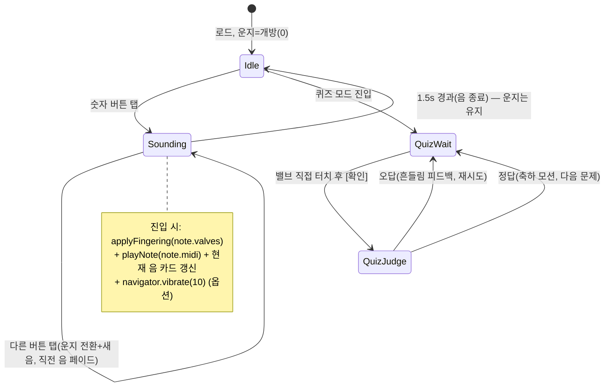
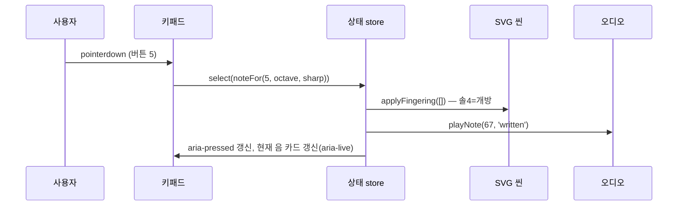
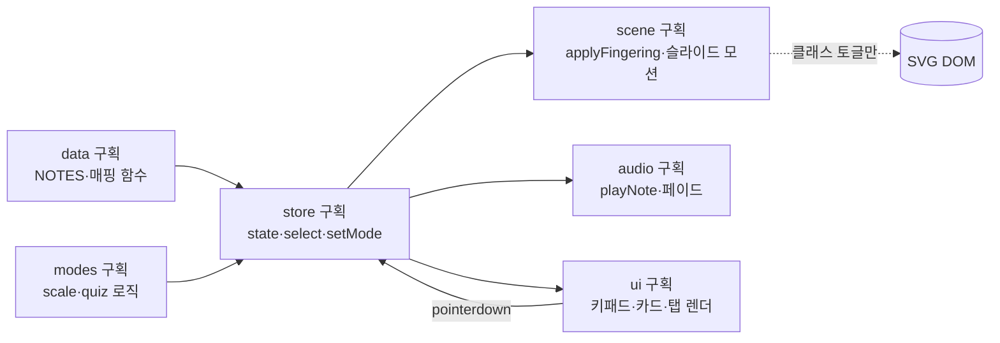

# 트럼펫 계이름 운지법 배우기 — 애니메이션 모바일 웹앱 개발서

| 항목 | 내용 |
|---|---|
| 문서 버전 | 1.0 |
| 작성일 | 2026-07-19 |
| 산출물 | 자기완결 단일 `index.html` 모바일 웹앱 |
| 소스 자료 | `01 Source/bb_trumpet_standard_fingering_chart.html` (=`_1` 동일 파일, SHA256 일치), `01 Source/trumpet-fingering-chart.html`, 동명 `.svg`/`.pdf` 차트 |
| 데이터 검증 | 두 소스의 31음 운지 데이터 상호 대조 완료(완전 일치), MIDI 54~84 |

---

## 1. 프로젝트 개요

### 1.1 목표
숫자 버튼(1~8)마다 **계이름(도~도)** 을 할당하고, 버튼을 누르면 화면 속 **트럼펫과 양손 SVG**가 해당 계이름의 운지대로 **손가락으로 밸브를 누르고 떼는 모션**을 실행하는 학습용 애니메이션 모바일 웹앱을 만든다. 동시에 해당 음이 Web Audio로 재생된다.

### 1.2 대상 사용자
- 트럼펫 입문자(초등~성인), 계이름↔운지 대응을 시각·청각·운동감각으로 익히려는 학습자
- 모바일(세로) 우선. 데스크톱/가로 모드도 지원

### 1.3 소스 자료 요약
| 파일 | 내용 | 이 앱에서 재사용하는 것 |
|---|---|---|
| `bb_trumpet_standard_fingering_chart.html` | F♯3~C6 31음 인터랙티브 운지표(A4 인쇄용 SVG 포함) | **31음 운지·계이름·대체운지·실음 데이터**, 빨강 밸브 표기 규칙, 접근성 패턴 |
| `trumpet-fingering-chart.html` | 밸브 피스톤 콘솔(누름 애니메이션)+소리 재생 운지표 | **MIDI 값(54~84)**, **Web Audio 합성 그래프**, 피스톤 누름 모션 값, velvet+brass 디자인 토큰, 키보드 입력 패턴 |
| `*.svg` (2종) | 정적 운지표 차트 (1600×1131 / 1200×831) | 오선보·음표 글리프 그리기 값(미니 악보 옵션), 높은음자리표 path |

### 1.4 산출물 정의
- **`index.html` 1개 파일**(외부 의존성 없음, 소스 자료들과 동일한 배포 형태). 인라인 `<style>`, 인라인 SVG 씬, 인라인 `<script type="module">`.
- 오프라인 동작, GitHub Pages/파일 직접 열기 모두 가능.

---

## 2. 트럼펫 운지 기초 (앱이 가르치는 음악적 사실)

앱의 애니메이션·문구는 아래 사실과 정확히 일치해야 한다.

1. **3밸브 원리** — 트럼펫은 피스톤 밸브 3개의 조합(2³=8가지 중 7조합 사용)과 입술(암부슈어)로 음을 만든다. 같은 운지로 여러 배음이 나므로, 같은 밸브 조합이 여러 음에 재사용된다.
2. **오른손 = 연주하는 손**
   - 검지 → **1번 밸브**(마우스피스에서 가장 가까운 밸브)
   - 중지 → **2번 밸브**(가운데)
   - 약지 → **3번 밸브**(벨 쪽)
   - 소지 → 핑거 후크(고리)에 걸침(움직이지 않음), 엄지 → 1·2번 밸브 사이 리드파이프 아래 받침
3. **왼손 = 악기를 잡는 손** — 밸브 케이싱을 감싸 파지한다. 약지(또는 중지)는 **3번 밸브 슬라이드 링**에 끼운다. 저음의 1-3, 1-2-3 조합에서 음정 보정을 위해 3번 슬라이드를 빼는 동작이 있다(앱에서는 심화 옵션 모션).
4. **B♭ 이조 악기** — 악보(기보음)보다 **장2도 낮게** 실제 소리(실음)가 난다. 기보 C4 → 실음 B♭3. 앱의 계이름은 **기보음 기준 고정 도법**(도=기보 C)을 기본으로 하고, 소리 재생은 기보음/실음 토글을 제공한다.
5. **표기 규칙(소스 준수)** — 붉은 원=누르는 밸브, 흰 원=놓는 밸브, `0`=개방(밸브를 모두 놓음). 이명동음은 병기(예: `F♯4 / G♭4`, 계이름 `파♯ / 솔♭`).

---

## 3. 데이터 모델

### 3.1 NOTES 배열 (F♯3~C6, 31음 — 소스에서 추출·검증 완료)

전체 JSON은 **부록 A**. 스키마:

```js
/** @typedef {Object} Note
 *  @property {number} midi         // 기보음 MIDI (54~84)
 *  @property {string} name         // 기보음 이름 "F♯3"
 *  @property {string|null} enh     // 이명동음 "G♭3" | null
 *  @property {string} solfege      // 한국어 계이름 "파♯ / 솔♭"
 *  @property {number[]} valves     // 주운지 [1,2,3], []=개방
 *  @property {number[][]} alts     // 대체 운지 목록 [[3]] 등
 *  @property {string} concert      // 실음 이름 "E3" (기보음 − 장2도)
 */
```

핵심 운지표(주운지만, 전체 표는 부록 A):

| 기보음 | 계이름 | 운지 | | 기보음 | 계이름 | 운지 | | 기보음 | 계이름 | 운지 |
|---|---|---|---|---|---|---|---|---|---|---|
| F♯3 | 파♯ | 1-2-3 | | F♯4 | 파♯ | 2 | | F♯5 | 파♯ | 2 |
| G3 | 솔 | 1-3 | | G4 | 솔 | 0 | | G5 | 솔 | 0 |
| G♯3 | 솔♯ | 2-3 | | G♯4 | 솔♯ | 2-3 | | G♯5 | 솔♯ | 2-3 |
| A3 | 라 | 1-2 | | A4 | 라 | 1-2 | | A5 | 라 | 1-2 |
| A♯3 | 시♭ | 1 | | A♯4 | 시♭ | 1 | | A♯5 | 시♭ | 1 |
| B3 | 시 | 2 | | B4 | 시 | 2 | | B5 | 시 | 2 |
| C4 | 도 | 0 | | C5 | 도 | 0 | | C6 | 도 | 0 |
| C♯4 | 도♯ | 1-2-3 | | C♯5 | 도♯ | 1-2 | | | | |
| D4 | 레 | 1-3 | | D5 | 레 | 1 | | | | |
| D♯4 | 레♯ | 2-3 | | D♯5 | 레♯ | 2 | | | | |
| E4 | 미 | 1-2 | | E5 | 미 | 0 | | | | |
| F4 | 파 | 1 | | F5 | 파 | 1 | | | | |

> 주의: 같은 계이름이라도 **옥타브에 따라 운지가 다르다**(예: 도♯4=1-2-3 vs 도♯5=1-2, 레4=1-3 vs 레5=1). 매핑은 반드시 `midi` 기준으로 조회한다.

### 3.2 숫자 버튼 → 계이름 매핑

**8버튼 키패드 + 옥타브 셀렉터(3단) + ♯ 모디파이어(토글)**

```js
const DEGREE_OFFSET = [0, 2, 4, 5, 7, 9, 11, 12]; // 도 레 미 파 솔 라 시 도(위)
const OCTAVE_BASE = { low: 48, mid: 60, high: 72 }; // C3, C4, C5
const SHARPABLE = [true, true, false, true, true, true, false, true]; // 미·시는 ♯ 없음

function midiFor(btn /*1~8*/, octaveMode, sharpOn) {
  const base = OCTAVE_BASE[octaveMode];
  let m = base + DEGREE_OFFSET[btn - 1];
  if (sharpOn) {
    if (!SHARPABLE[btn - 1]) return null;   // 미♯·시♯ 미지원 → 버튼 비활성
    m += 1;
  }
  return (m >= 54 && m <= 84) ? m : null;   // 음역(F♯3~C6) 밖 → 버튼 비활성
}
const noteFor = (btn, oct, sharp) => NOTES.find(n => n.midi === midiFor(btn, oct, sharp));
```

매핑 결과표:

| 버튼 | 기본(옥타브 4) | +♯ | 높은(옥타브 5) | +♯ | 낮은(옥타브 3) | +♯ |
|---|---|---|---|---|---|---|
| 1 | 도 C4 | 도♯ C♯4 | 도 C5 | 도♯ C♯5 | ~~도 C3~~ | ~~—~~ |
| 2 | 레 D4 | 레♯ D♯4 | 레 D5 | 레♯ D♯5 | ~~레 D3~~ | ~~—~~ |
| 3 | 미 E4 | — | 미 E5 | — | ~~미 E3~~ | — |
| 4 | 파 F4 | 파♯ F♯4 | 파 F5 | 파♯ F♯5 | ~~파 F3~~ | 파♯ F♯3 |
| 5 | 솔 G4 | 솔♯ G♯4 | 솔 G5 | 솔♯ G♯5 | 솔 G3 | 솔♯ G♯3 |
| 6 | 라 A4 | 라♯ A♯4 | 라 A5 | 라♯ A♯5 | 라 A3 | 라♯ A♯3 |
| 7 | 시 B4 | — | 시 B5 | — | 시 B3 | — |
| 8 | 도 C5 | 도♯ C♯5 | 도 C6 | ~~도♯ C♯6~~ | 도 C4 | 도♯ C♯4 |

- ~~취소선~~ = 소스 음역(F♯3~C6) 밖 → **버튼 비활성**(회색 처리 + `disabled`). `—` = ♯ 조합이 존재하지 않는 계이름(미·시) → ♯ 모드에서 비활성.
- ♯ 모드에서 키패드 라벨이 실시간으로 바뀐다: `도` → `도♯`(이명동음 병기 `레♭`).
- 버튼 라벨은 항상 **큰 숫자 + 계이름 병기**(예: `5` / `솔`).

### 3.3 대체 운지 (12음 — 심화 토글 시 노출)

A3→3, D4→3, E4→3, G4→1-3, A4→3, C5→2-3, D5→1-3, E♭5→2-3, E5→1-2·3, F♯5→1-3, G5→1-3, A5→3 (부록 B에 상세 표).

---

## 4. 화면 설계

### 4.1 모바일 세로 (기준 360×740)

```
┌──────────────────────────────────┐
│  ♪ 트럼펫 운지법 배우기     [☰]  │  헤더 44px (velvet 배경)
├──────────────────────────────────┤
│ ┌──────────────────────────────┐ │
│ │  솔          G4 · 개방 0     │ │  현재 음 카드 72px
│ │  (계이름 크게) (음이름·운지)  │ │  aria-live="polite"
│ │  ○ ○ ○  [♪ 미니 오선보 옵션] │ │  밸브 3원 인디케이터
│ └──────────────────────────────┘ │
│ ┌──────────────────────────────┐ │
│ │                              │ │
│ │      [트럼펫+양손 SVG 씬]     │ │  SVG 씬 (가로폭 100%,
│ │       viewBox 0 0 720 520    │ │  높이 ≈ 화면폭×0.72)
│ │                              │ │
│ └──────────────────────────────┘ │
│  [자유]  [스케일 연습]  [퀴즈]    │  모드 탭 40px
├──────────────────────────────────┤
│ [낮은 8va] [기본] [높은 8va] [♯] │  옥타브 3단 + ♯ 토글 48px
│ ┌────┬────┬────┬────┐            │
│ │ 1  │ 2  │ 3  │ 4  │            │  숫자 키패드
│ │ 도 │ 레 │ 미 │ 파 │            │  버튼 최소 64×56px
│ ├────┼────┼────┼────┤            │  (터치 타겟 ≥44px 준수)
│ │ 5  │ 6  │ 7  │ 8  │            │
│ │ 솔 │ 라 │ 시 │ 도⁺│            │
│ └────┴────┴────┴────┘            │
└──────────────────────────────────┘
```

### 4.2 가로 모드 / 태블릿 (≥600px 가로)
좌측 60% SVG 씬 + 현재 음 카드, 우측 40% 키패드(세로 2×4). 키패드가 엄지 도달 범위에 오도록 우측 고정.

### 4.3 컴포넌트 명세

| 컴포넌트 | id/클래스 | 역할 |
|---|---|---|
| 현재 음 카드 | `#now-card` | 계이름(32px/800), 음이름+운지 텍스트, 밸브 3원(소스 `valveHTML` 패턴: ON=빨강 `#C62828` 채움+흰 숫자) |
| SVG 씬 | `#scene` | §5. 트럼펫+양손, 애니메이션 대상 |
| 모드 탭 | `.mode-tabs button[aria-pressed]` | 자유/스케일/퀴즈 전환 |
| 옥타브 셀렉터 | `.seg#octave` | 3단 세그먼트(소스 `.seg` 스타일 계승) |
| ♯ 토글 | `#sharp-toggle[aria-pressed]` | 켜면 키패드 라벨 일괄 변경 |
| 숫자 키패드 | `#keypad .key[data-btn]` | 4×2 그리드. 눌림 시 `aria-pressed="true"`+brass 배경 |
| 설정 시트 | `#settings` | 기보음/실음, 대체운지 표시, 사운드 on/off, 햅틱, 감속 모션 |

### 4.4 반응형 브레이크포인트
- `≤ 599px`: §4.1 세로 스택
- `600–899px`: 가로 2단
- `≥ 900px`(데스크톱): 최대폭 960px 중앙 정렬, 키보드 단축키 힌트 노출(소스 패턴 계승: 본 앱은 `1~8`=계이름 버튼, `Shift`=♯, `↑/↓`=옥타브, `Space`=재재생)

---

## 5. SVG 씬 설계 (트럼펫 + 양손)

### 5.1 좌표계와 방향
- `viewBox="0 0 720 520"`, 관객 시점 측면 뷰. **벨=왼쪽, 마우스피스=오른쪽**.
- 따라서 **1번 밸브가 오른쪽**(마우스피스 쪽), 3번 밸브가 왼쪽. 오른손은 오른쪽 위에서 접근, 왼손은 아래에서 파지.
- 주 배관 중심선 `y=300`. 밸브 중심 x: **1번=402, 2번=342, 3번=282** (간격 60).

### 5.2 레이어 트리 (ID 체계 — 코드가 참조하는 계약)

```
#scene (svg)
├─ #bg                    배경(velvet 라운드 카드)
├─ #trumpet
│   ├─ #bell              벨(x 60→240 확장 곡면, brass 그라디언트)
│   ├─ #main-tube         주 배관(y=300 수평, x 240→560)
│   ├─ #leadpipe          리드파이프+마우스피스(x 560→655)
│   ├─ #tuning-slide      튜닝 슬라이드(하단 U자, x 190~246 — 벨과 casing-3 사이, 케이싱과 겹치지 않게)
│   ├─ #valve-casings
│   │    ├─ #casing-3 (x=282) ├─ #casing-2 (x=342) ├─ #casing-1 (x=402)
│   │    │   각: rect w34, y 252→392, 라운드 6
│   ├─ #slide-3           3번 밸브 슬라이드(casing-3 왼쪽으로 돌출, #slide-3-ring 포함)
│   ├─ #valve-1  ──┐
│   ├─ #valve-2    ├ 움직이는 부분: #cap-N(원 r15, 중심 y=210) + #stem-N(rect w10, y 225→252)
│   └─ #valve-3  ──┘
├─ #left-hand             정적(파지 포즈)
│   ├─ #lh-palm           밸브 블록 하단 감싸는 형태(대략 x 250~415, y 330~455)
│   ├─ #lh-thumb          casing-1 오른쪽 면을 감싸 위로
│   ├─ #lh-fingers        casing-3 왼쪽 면 감싸는 손가락 3개 묶음
│   └─ #lh-ring-finger    #slide-3-ring 안에 끝마디(심화 모션 시 슬라이드와 함께 -14px x이동)
└─ #right-hand
    ├─ #rh-forearm        오른쪽 상단 바깥으로 나가는 손목/전완
    ├─ #rh-palm           대략 x 455~570, y 140~235
    ├─ #rh-thumb          리드파이프 아래(x 470, y 250 부근), 정적
    ├─ #rh-pinky          핑거 후크(x 452, y 262)에 걸림, 정적
    ├─ #rh-index          검지: MCP 피벗 (468,166) → 끝마디 패드 (402,193) = cap-1 위
    │    ├─ .seg-prox / .seg-mid / .seg-tip   (마디 3개, 필요시 단순화 가능)
    ├─ #rh-middle         중지: MCP 피벗 (452,150) → 패드 (342,193) = cap-2 위
    └─ #rh-ring           약지: MCP 피벗 (438,158) → 패드 (282,193) = cap-3 위
```

기하 검증: 캡 상단면 y≈195(중심 210 − r15). 손끝 패드 y=193(캡 위 접촉). 눌림 시 캡 중심 210→**222**(+12px), 손끝도 −10° 회전으로 y≈204(+11px) — 오차 ≤2px로 접촉 유지(§6.2).

### 5.3 SVG 스켈레톤 코드

```html
<svg id="scene" viewBox="0 0 720 520" role="img"
     aria-label="트럼펫과 양손 운지 애니메이션">
  <defs>
    <linearGradient id="brass" x1="0" y1="0" x2="0" y2="1">
      <stop offset="0" stop-color="#E8CE7A"/><stop offset=".45" stop-color="#C9A227"/>
      <stop offset="1" stop-color="#8A6A1F"/>
    </linearGradient>
    <linearGradient id="skin" x1="0" y1="0" x2="0" y2="1">
      <stop offset="0" stop-color="#F6D7B6"/><stop offset="1" stop-color="#E0AC7E"/>
    </linearGradient>
  </defs>
  <rect id="bg" width="720" height="520" rx="24" fill="#17302E"/>

  <g id="trumpet">
    <path id="bell" fill="url(#brass)" stroke="#6B531B" stroke-width="3"
      d="M60 240 C130 258 200 282 240 288 L240 312 C200 318 130 342 60 360
         C48 340 42 320 42 300 C42 280 48 260 60 240 Z"/>
    <rect id="main-tube" x="238" y="288" width="324" height="24" rx="12"
      fill="url(#brass)" stroke="#6B531B" stroke-width="3"/>
    <path id="leadpipe" fill="url(#brass)" stroke="#6B531B" stroke-width="3"
      d="M560 290 L630 292 L655 284 L655 316 L630 308 L560 310 Z"/>
    <path id="tuning-slide" fill="none" stroke="url(#brass)" stroke-width="14"
      d="M190 312 L190 368 A28 28 0 0 0 246 368 L246 312"/>
    <g id="valve-casings" fill="url(#brass)" stroke="#6B531B" stroke-width="3">
      <rect id="casing-3" x="265" y="252" width="34" height="140" rx="6"/>
      <rect id="casing-2" x="325" y="252" width="34" height="140" rx="6"/>
      <rect id="casing-1" x="385" y="252" width="34" height="140" rx="6"/>
    </g>
    <g id="slide-3">
      <rect x="212" y="344" width="56" height="14" rx="7" fill="url(#brass)"/>
      <circle id="slide-3-ring" cx="228" cy="330" r="13" fill="none"
              stroke="url(#brass)" stroke-width="5"/>
    </g>
    <!-- 움직이는 밸브: cap+stem 을 한 그룹으로 -->
    <g id="valve-1" class="valve">
      <rect id="stem-1" x="397" y="225" width="10" height="28" fill="#54706B"/>
      <circle id="cap-1" cx="402" cy="210" r="15" fill="#F4EFE4"
              stroke="#3A5450" stroke-width="4"/>
    </g>
    <g id="valve-2" class="valve">
      <rect id="stem-2" x="337" y="225" width="10" height="28" fill="#54706B"/>
      <circle id="cap-2" cx="342" cy="210" r="15" fill="#F4EFE4"
              stroke="#3A5450" stroke-width="4"/>
    </g>
    <g id="valve-3" class="valve">
      <rect id="stem-3" x="277" y="225" width="10" height="28" fill="#54706B"/>
      <circle id="cap-3" cx="282" cy="210" r="15" fill="#F4EFE4"
              stroke="#3A5450" stroke-width="4"/>
    </g>
  </g>

  <g id="left-hand" fill="url(#skin)" stroke="#B9814F" stroke-width="2.5">
    <path id="lh-palm" d="M250 360 Q240 430 290 452 Q350 466 405 448
                          Q418 400 412 352 L395 340 Q340 372 268 344 Z"/>
    <path id="lh-thumb" d="M412 352 Q432 330 424 296 Q416 280 404 288
                           Q398 320 396 344 Z"/>
    <path id="lh-fingers" d="M268 344 Q246 336 240 356 Q238 380 252 392
                             Q262 396 268 388 Z"/>
    <path id="lh-ring-finger" d="M252 348 Q232 336 224 330 Q218 326 222 320
                                 Q232 316 240 322 Q252 330 258 338 Z"/>
  </g>

  <g id="right-hand">
    <path id="rh-forearm" fill="url(#skin)" stroke="#B9814F" stroke-width="2.5"
          d="M560 130 Q640 96 720 92 L720 190 Q640 196 574 224 Z"/>
    <path id="rh-palm" fill="url(#skin)" stroke="#B9814F" stroke-width="2.5"
          d="M455 168 Q470 136 520 130 Q570 128 574 168 Q576 210 552 232
             Q510 244 472 226 Q452 200 455 168 Z"/>
    <path id="rh-thumb" fill="url(#skin)" stroke="#B9814F" stroke-width="2.5"
          d="M472 226 Q462 244 468 258 Q476 268 486 262 Q492 248 490 234 Z"/>
    <path id="rh-pinky" fill="url(#skin)" stroke="#B9814F" stroke-width="2.5"
          d="M540 232 Q528 252 500 262 Q470 268 452 262 Q446 256 452 250
             Q490 246 522 226 Z"/>
    <!-- 움직이는 손가락 3개: 피벗은 CSS transform-origin 으로 지정 -->
    <g id="rh-index" class="finger" data-valve="1">
      <path fill="url(#skin)" stroke="#B9814F" stroke-width="2.5"
        d="M468 158 Q436 168 414 182 Q398 190 396 196 Q398 204 408 202
           Q436 192 470 178 Z"/>
    </g>
    <g id="rh-middle" class="finger" data-valve="2">
      <path fill="url(#skin)" stroke="#B9814F" stroke-width="2.5"
        d="M452 142 Q400 152 356 182 Q336 192 336 198 Q340 206 350 202
           Q398 184 456 162 Z"/>
    </g>
    <g id="rh-ring" class="finger" data-valve="3">
      <path fill="url(#skin)" stroke="#B9814F" stroke-width="2.5"
        d="M438 150 Q380 164 300 184 Q276 190 276 197 Q280 205 290 202
           Q356 188 442 170 Z"/>
    </g>
  </g>
</svg>
```

> 위 path 좌표는 **형태 근사값**이다. 구현 시 실루엣을 다듬되, **계약 사항**(요소 ID, 밸브 중심 x=402/342/282, 캡 중심 y=210, 캡 상단 y≈195, 손끝 패드 좌표, MCP 피벗 좌표)은 변경하지 않는다. 변경하면 §6의 수치가 함께 갱신되어야 한다.

---

## 6. 애니메이션 명세

### 6.1 원칙
- 상태는 **CSS 클래스**(`.pressed`)로 표현하고 전환은 **CSS transition**이 담당한다(소스 피스톤 콘솔과 동일한 접근). JS는 클래스 토글과 타이밍 오케스트레이션만 한다. 실패해도 최종 상태는 항상 올바르다(전환이 끊겨도 클래스가 진실).
- SVG 그룹 변형은 `transform-box: fill-box` 없이 **viewBox 좌표계 기준 `transform-origin`을 px로 직접 지정**한다(iOS Safari 호환이 가장 안전한 방식).

### 6.2 키프레임 테이블

| # | 대상 | 속성 | rest → pressed | 지속 | 이징 | transform-origin |
|---|---|---|---|---|---|---|
| A1 | `#valve-N` (cap+stem) | `transform: translateY` | `0 → 12px` | **누름 110ms** | `cubic-bezier(.3,0,.2,1)` | — |
| A2 | `#valve-N` | `translateY` | `12px → 0` | **떼기 150ms** | `cubic-bezier(.34,1.3,.3,1)` (살짝 오버슈트) | — |
| B1 | `#rh-index` | `transform: rotate` | `0 → **-10deg**` | 누름 110ms | A1과 동일 | `468px 166px` |
| B2 | `#rh-middle` | `rotate` | `0 → **-6deg**` | 〃 | 〃 | `452px 150px` |
| B3 | `#rh-ring` | `rotate` | `0 → **-4.5deg**` | 〃 | 〃 | `438px 158px` |
| C | `#cap-N` | `fill`, `stroke` | `#F4EFE4/#3A5450 → #C9A227/#6B531B` | 110ms | linear | — |
| D | 키패드 `.key` | `background`, `translateY(1px)` | 눌림 표시 | 80ms | ease-out | — |

- **회전 방향 근거**: 손끝이 피벗 왼쪽에 있으므로 SVG에서 **음수 각도**가 손끝을 아래로 내린다.
- **손가락별 각도가 다른 이유(필수)**: 손끝 하강량 ≈ `피벗~손끝 수평거리 × sin(각도)`. 세 손가락의 피벗 거리가 달라 같은 각도를 쓰면 중지·약지가 캡(12px)보다 깊이 내려가 **캡을 뚫는다**. 거리 반비례로 보정한 값:
  - 검지: 거리 71px → `71×sin10° ≈ 11.1px` (보정항 포함)
  - 중지: 거리 118px → `110×sin6° ≈ 11.3px`
  - 약지: 거리 160px → `156×sin4.5° ≈ 12.1px`
  - 세 값 모두 캡 이동 12px 대비 오차 ≤1px → 접촉 유지. **피벗·손끝 좌표를 바꾸면 각도를 `asin(12/수평거리)`로 재계산할 것.**
- 손가락과 캡은 **같은 타이밍·같은 이징**으로 동시 구동(끊김 없는 접촉 착시).
- **복수 밸브 동시**: 조합의 모든 밸브·손가락에 클래스를 같은 프레임에 토글(스태거 없음 — 실제 연주와 동일). 학습 강조 옵션 켜면 40ms 스태거(1→2→3 순).

### 6.3 CSS

```css
#scene .valve, #scene .finger {
  transition: transform 110ms cubic-bezier(.3,0,.2,1);
  will-change: transform;
}
#scene .valve.pressed  { transform: translateY(12px); }
#scene .finger.pressed { transform: rotate(var(--press)); }
#rh-index  { --press: -10deg;  transform-origin: 468px 166px; }
#rh-middle { --press: -6deg;   transform-origin: 452px 150px; }
#rh-ring   { --press: -4.5deg; transform-origin: 438px 158px; }
/* 떼기: 스프링감 있는 복귀 */
#scene .valve:not(.pressed), #scene .finger:not(.pressed) {
  transition: transform 150ms cubic-bezier(.34,1.3,.3,1);
}
#scene .valve.pressed circle { fill:#C9A227; stroke:#6B531B; transition: fill 110ms, stroke 110ms; }

@media (prefers-reduced-motion: reduce) {
  #scene .valve, #scene .finger, #scene .valve.pressed circle { transition: none; }
  /* 모션 대신 색·인디케이터로만 상태 전달 (소스와 동일 패턴: *{transition:none}) */
}
```

### 6.4 오케스트레이션 (JS)

```js
const valveEls  = [1,2,3].map(n => document.getElementById(`valve-${n}`));
const fingerEls = { 1: byId('rh-index'), 2: byId('rh-middle'), 3: byId('rh-ring') };

/** 현재 밸브 상태를 목표 조합으로 전환. 연타 안전: 항상 최신 목표만 반영 */
function applyFingering(valves /* number[] */) {
  for (const n of [1, 2, 3]) {
    const on = valves.includes(n);
    valveEls[n - 1].classList.toggle('pressed', on);
    fingerEls[n].classList.toggle('pressed', on);
  }
}
```

- **연속 입력(연타) 규칙**: `applyFingering`은 멱등. 진행 중 transition은 브라우저가 현재 위치에서 새 목표로 자연 보간하므로 **취소·큐잉 로직 불필요**. 오디오만 직전 음 페이드아웃(§7).
- 리듬 모드 등 정밀 시퀀스가 필요해지면 같은 클래스 토글을 `element.animate()`(WAAPI)로 감싸 `finished` Promise로 체이닝한다(선택 확장).

### 6.5 심화: 3번 슬라이드 모션(옵션, 기본 off)
운지가 `[1,3]` 또는 `[1,2,3]`일 때 `#slide-3`과 `#lh-ring-finger`에 `transform: translateX(-14px)` 220ms ease-out. 설정에서 "슬라이드 보정 보기" 켠 경우에만.

---

## 7. 사운드 설계 (소스 합성 그래프 계승)

`trumpet-fingering-chart.html`의 검증된 그래프를 그대로 사용한다.

```
[saw osc f] ──────────────┐
[sine osc 2f]─[gain .12]──┴─[lowpass f×5.5, Q .8]─[gain 엔벨로프]─[destination]
```

```js
const A4 = 440;
const freq = m => A4 * Math.pow(2, (m - 69) / 12);
let ctx;                                   // 첫 입력 제스처에서 생성(iOS 언락)
function playNote(midi, mode /* 'written'|'concert' */) {
  const m = mode === 'written' ? midi : midi - 2;   // 실음 = 기보 − 장2도
  ctx = ctx || new (window.AudioContext || window.webkitAudioContext)();
  if (ctx.state === 'suspended') ctx.resume();
  const t = ctx.currentTime, f = freq(m);
  const o1 = ctx.createOscillator(); o1.type = 'sawtooth'; o1.frequency.value = f;
  const o2 = ctx.createOscillator(); o2.type = 'sine';     o2.frequency.value = f * 2;
  const g2 = ctx.createGain(); g2.gain.value = .12;
  const lp = ctx.createBiquadFilter(); lp.type = 'lowpass';
  lp.frequency.setValueAtTime(f * 5.5, t); lp.Q.value = .8;
  const g = ctx.createGain();
  g.gain.setValueAtTime(0, t);
  g.gain.linearRampToValueAtTime(.28, t + .025);   // 어택 25ms
  g.gain.setTargetAtTime(.2,  t + .05, .12);       // 디케이→서스테인 .2
  g.gain.setTargetAtTime(0,   t + .85, .09);       // 릴리스
  o1.connect(lp); o2.connect(g2); g2.connect(lp); lp.connect(g); g.connect(ctx.destination);
  o1.start(t); o2.start(t); o1.stop(t + 1.5); o2.stop(t + 1.5);
  return { stop: () => g.gain.setTargetAtTime(0, ctx.currentTime, .05) }; // 연타 시 직전 음 페이드
}
```

- 연타 정책: 새 음 재생 시 직전 노트 핸들의 `stop()` 호출(50ms 페이드) 후 새 음 시작.
- 예시 주파수(기본 옥타브, 기보음 기준): 도 C4=261.63, 레 D4=293.66, 미 E4=329.63, 파 F4=349.23, 솔 G4=392.00, 라 A4=440.00, 시 B4=493.88, 도 C5=523.25 Hz. 실음 토글 시 −2 반음.

---

## 8. 인터랙션 · 상태 머신

### 8.1 앱 상태

```js
const state = {
  mode: 'free',            // 'free' | 'scale' | 'quiz'
  octave: 'mid',           // 'low' | 'mid' | 'high'
  sharp: false,
  pitchMode: 'written',    // 'written' | 'concert'
  showAlt: false, sound: true, haptic: true, slideMotion: false,
  current: null,           // 현재 Note | null
  quiz: { target: null, tries: 0, score: 0 },
  scale: { step: 0 },      // 0~7 (도→도)
};
```

### 8.2 상태 다이어그램



### 8.3 버튼 탭 시퀀스



- 입력은 `pointerdown` 기준(터치 지연 제거, `touch-action: manipulation`).
- 멀티터치: 마지막 `pointerdown`이 승리(단음 악기 — 화음 없음). 진행 중 포인터가 있어도 새 입력이 상태를 덮는다.
- 데스크톱 키보드: `1`~`8`=버튼, `Shift`=♯ 모멘터리, `↑/↓`=옥타브, `Space`=현재 음 재재생(소스 패턴 계승).

---

## 9. 아키텍처 · 파일 구조

### 9.1 기술 스택
- **프레임워크 없음.** 단일 `index.html` + 인라인 CSS/SVG/JS(ES2020). 소스 자료 2종과 동일한 자기완결 형태 → 파일 하나 복사로 배포 완료.
- 상태 관리: 단일 `state` 객체 + `render()` 단방향 갱신(소스 `choose()` 패턴 확장).

### 9.2 논리 모듈 구성 (하나의 script 안에서 섹션 구분)



각 구획의 공개 API:

| 구획 | API | 비고 |
|---|---|---|
| data | `NOTES`, `midiFor(btn,oct,sharp)`, `noteFor(...)` | §3. 순수 함수, 유닛테스트 대상 |
| store | `select(note)`, `setOctave(o)`, `setSharp(b)`, `setMode(m)` | 모든 변이는 여기서만 |
| scene | `applyFingering(valves)`, `setSlideMotion(b)` | DOM 클래스 토글만 수행 |
| audio | `playNote(midi, pitchMode) → {stop}` | ctx 지연 생성 |
| ui | `render(state)` | 키패드 라벨/disabled, 현재 음 카드, 탭 |
| modes | `scaleNext()`, `quizNew()`, `quizJudge(valves)` | §10 |

### 9.3 성능 예산 / 엣지 케이스
- 첫 페인트 < 1s(3G Fast), JS < 40KB(압축 전), 외부 요청 0건(폰트도 시스템 스택: `"NanumSquareRound","Noto Sans KR","Apple SD Gothic Neo","Malgun Gothic",sans-serif`).
- 애니메이션은 `transform`/`fill`만 사용 → 합성 단계 처리, 60fps.
- 엣지: 오디오 미지원(playNote try/catch 후 무음 진행) · iOS 무음 스위치(시각 피드백은 항상 동작) · 화면 회전(SVG는 viewBox라 무손상) · 빠른 연타(§6.4 멱등) · `disabled` 버튼 탭(무반응+짧은 흔들림).

---

## 10. 학습 모드 상세

### 10.1 자유 연주 (기본)
버튼 탭 → 운지 모션+소리. 현재 음 카드에 계이름·음이름·운지·(옵션)대체운지 칩(소스 골드 칩 스타일)·(옵션)미니 오선보 표시.

### 10.2 스케일 연습
- 도(C4)→도(C5) 8음을 순서대로. **다음에 누를 버튼이 키패드에서 골드 펄스**(box-shadow 애니메이션 800ms 루프)로 안내된다.
- 올바른 버튼을 누르면 `scale.step++`, 완주 시 축하 배너+전체 스케일 자동 재생(각 음 500ms 간격, 운지 모션 동기).
- 틀린 버튼은 무시하지 않고 소리·모션은 내주되 "안내를 따라가 보세요" 토스트. 옥타브/♯ 상태는 모드 진입 시 기본으로 강제 리셋.

### 10.3 퀴즈
- 문제: 현재 음 카드에 **계이름만** 크게 표시(음이름·운지 숨김). 키패드는 잠금.
- 답안: **SVG 밸브가 직접 터치 입력**이 된다(캡 탭 → 눌림 토글, 소스 피스톤 콘솔 패턴). `[확인]` 탭 시 판정.
- 판정: `눌린 밸브 집합 === note.valves` (순서 무관, `keyOf` 비교).
  - 정답: 캡 3개 골드 플래시 200ms×2 + 정답음 재생 + `score++`, 1.2s 후 다음 문제.
  - 오답: 씬 전체 `translateX` ±6px 흔들림 240ms + 올바른 운지를 1.5s 시연(모션+반투명 가이드) 후 재시도.
- 출제 범위: 현재 옥타브 모드의 활성 음 중 무작위(직전 문제 제외).

---

## 11. 접근성 · 성능

| 항목 | 구현 |
|---|---|
| 스크린리더 | 현재 음 카드 `aria-live="polite"`로 "솔, 개방 0" 낭독. 키패드 `aria-label="5번 솔"`. SVG `role="img"+aria-label` |
| 상태 노출 | 모든 토글 `aria-pressed`, 탭 `role="tablist"` |
| 터치 타겟 | 최소 44×44px(키패드 64×56px) |
| 색약 대응 | 눌린 밸브 = 색(골드)+위치(내려감)+캡 테두리 굵기 3중 부호화. 빨강 단독 의존 금지 |
| 모션 민감 | `prefers-reduced-motion` → transition 제거, 상태는 색·텍스트로 전달 |
| 햅틱 | `navigator.vibrate(10)` 옵션(미지원 브라우저 무시) |
| 폰트 확대 | 텍스트 rem 단위, 200% 확대에서 레이아웃 유지 |

---

## 12. 구현 로드맵

- **M1 — 정적 씬+데이터 (½일)**
  - [ ] NOTES 31음+매핑 함수 이식(부록 A 그대로), 유닛 테스트(콘솔 assert)
  - [ ] SVG 씬 렌더(§5 스켈레톤), 키패드/옥타브/♯ UI, disabled 규칙
- **M2 — 모션+사운드 (½일)**
  - [ ] §6 CSS transition+applyFingering, 색 피드백
  - [ ] §7 오디오 이식, 연타 페이드, iOS 언락
- **M3 — 학습 모드 (1일)**
  - [ ] 자유/스케일/퀴즈, 퀴즈용 밸브 직접 터치
- **M4 — 마감 (½일)**
  - [ ] 접근성 점검(§11 표 전 항목), reduced-motion, 가로 모드
  - [ ] 실기기 QA(iOS Safari, Android Chrome), §13 시나리오 통과

## 13. 테스트 계획

| # | 시나리오 | 기대 결과 |
|---|---|---|
| T1 | 기본 옥타브에서 1~8 순서 탭 | 도~도 운지가 표(§3.1)와 일치: 0/1-3/1-2/1/0/1-2/2/0. 각 음 재생 |
| T2 | ♯ 토글 후 키패드 확인 | 3·7번 비활성, 라벨 도♯·레♯·파♯·솔♯·라♯ 병기로 변경 |
| T3 | 낮은 옥타브 진입 | 1~4 비활성(♯ 시 4만 활성=파♯3), 5·6·7·8 활성 |
| T4 | 높은 옥타브+♯에서 8번 | 비활성(C♯6 음역 밖) |
| T5 | 솔(개방)→파♯(2)→도♯4(1-2-3) 연속 탭 | 손가락·캡이 끊김 없이 전환, 접촉 유지, 이전 음 페이드 |
| T6 | 같은 버튼 빠른 연타 10회 | 모션 멱등, 오디오 클리핑 없음 |
| T7 | 퀴즈 "레(4옥타브)"에 1-3 입력 | 정답 처리(레4=1-3). "레(5옥타브)" 문제에 1-3 입력 시 오답+시연(레5=1) |
| T8 | 실음 토글 후 도 재생 | 233.08Hz(B♭3) — 기보 261.63Hz 대비 −2반음 |
| T9 | prefers-reduced-motion 활성 기기 | 즉시 상태 전환, 기능 동일 |
| T10 | 기내모드/무음 | UI·모션 정상, 오류 없음 |

---

## 부록 A. 전체 운지 데이터 (NOTES — 소스 검증본)

```json
[
  {"midi":54,"name":"F♯3","enh":"G♭3","solfege":"파♯ / 솔♭","valves":[1,2,3],"alts":[],"concert":"E3"},
  {"midi":55,"name":"G3","enh":null,"solfege":"솔","valves":[1,3],"alts":[],"concert":"F3"},
  {"midi":56,"name":"G♯3","enh":"A♭3","solfege":"솔♯ / 라♭","valves":[2,3],"alts":[],"concert":"G♭3"},
  {"midi":57,"name":"A3","enh":null,"solfege":"라","valves":[1,2],"alts":[[3]],"concert":"G3"},
  {"midi":58,"name":"A♯3","enh":"B♭3","solfege":"라♯ / 시♭","valves":[1],"alts":[],"concert":"A♭3"},
  {"midi":59,"name":"B3","enh":null,"solfege":"시","valves":[2],"alts":[],"concert":"A3"},
  {"midi":60,"name":"C4","enh":null,"solfege":"도","valves":[],"alts":[],"concert":"B♭3"},
  {"midi":61,"name":"C♯4","enh":"D♭4","solfege":"도♯ / 레♭","valves":[1,2,3],"alts":[],"concert":"B3"},
  {"midi":62,"name":"D4","enh":null,"solfege":"레","valves":[1,3],"alts":[[3]],"concert":"C4"},
  {"midi":63,"name":"D♯4","enh":"E♭4","solfege":"레♯ / 미♭","valves":[2,3],"alts":[],"concert":"D♭4"},
  {"midi":64,"name":"E4","enh":null,"solfege":"미","valves":[1,2],"alts":[[3]],"concert":"D4"},
  {"midi":65,"name":"F4","enh":null,"solfege":"파","valves":[1],"alts":[],"concert":"E♭4"},
  {"midi":66,"name":"F♯4","enh":"G♭4","solfege":"파♯ / 솔♭","valves":[2],"alts":[],"concert":"E4"},
  {"midi":67,"name":"G4","enh":null,"solfege":"솔","valves":[],"alts":[[1,3]],"concert":"F4"},
  {"midi":68,"name":"G♯4","enh":"A♭4","solfege":"솔♯ / 라♭","valves":[2,3],"alts":[],"concert":"G♭4"},
  {"midi":69,"name":"A4","enh":null,"solfege":"라","valves":[1,2],"alts":[[3]],"concert":"G4"},
  {"midi":70,"name":"A♯4","enh":"B♭4","solfege":"라♯ / 시♭","valves":[1],"alts":[],"concert":"A♭4"},
  {"midi":71,"name":"B4","enh":null,"solfege":"시","valves":[2],"alts":[],"concert":"A4"},
  {"midi":72,"name":"C5","enh":null,"solfege":"도","valves":[],"alts":[[2,3]],"concert":"B♭4"},
  {"midi":73,"name":"C♯5","enh":"D♭5","solfege":"도♯ / 레♭","valves":[1,2],"alts":[],"concert":"B4"},
  {"midi":74,"name":"D5","enh":null,"solfege":"레","valves":[1],"alts":[[1,3]],"concert":"C5"},
  {"midi":75,"name":"D♯5","enh":"E♭5","solfege":"레♯ / 미♭","valves":[2],"alts":[[2,3]],"concert":"D♭5"},
  {"midi":76,"name":"E5","enh":null,"solfege":"미","valves":[],"alts":[[1,2],[3]],"concert":"D5"},
  {"midi":77,"name":"F5","enh":null,"solfege":"파","valves":[1],"alts":[],"concert":"E♭5"},
  {"midi":78,"name":"F♯5","enh":"G♭5","solfege":"파♯ / 솔♭","valves":[2],"alts":[[1,3]],"concert":"E5"},
  {"midi":79,"name":"G5","enh":null,"solfege":"솔","valves":[],"alts":[[1,3]],"concert":"F5"},
  {"midi":80,"name":"G♯5","enh":"A♭5","solfege":"솔♯ / 라♭","valves":[2,3],"alts":[],"concert":"G♭5"},
  {"midi":81,"name":"A5","enh":null,"solfege":"라","valves":[1,2],"alts":[[3]],"concert":"G5"},
  {"midi":82,"name":"A♯5","enh":"B♭5","solfege":"라♯ / 시♭","valves":[1],"alts":[],"concert":"A♭5"},
  {"midi":83,"name":"B5","enh":null,"solfege":"시","valves":[2],"alts":[],"concert":"A5"},
  {"midi":84,"name":"C6","enh":null,"solfege":"도","valves":[],"alts":[],"concert":"B♭5"}
]
```

> 출처: `bb_trumpet_standard_fingering_chart.html`의 `NOTES` 배열(운지·계이름·대체운지·실음) + `trumpet-fingering-chart.html`의 `NOTES` 배열(MIDI). 두 소스의 밸브 조합 31개 전부 일치함을 확인. 실음 임시표는 소스 표기(플랫 통일)를 따름.

## 부록 B. 대체 운지표 (12음)

| 기보음 | 주운지 | 대체 운지 | 용도(소스 문구 기준) |
|---|---|---|---|
| A3 | 1-2 | 3 | 빠른 패시지·음정·음색에 따라 선택 |
| D4 | 1-3 | 3 | 〃 |
| E4 | 1-2 | 3 | 〃 |
| G4 | 0 | 1-3 | 〃 |
| A4 | 1-2 | 3 | 〃 |
| C5 | 0 | 2-3 | 〃 |
| D5 | 1 | 1-3 | 〃 |
| D♯5/E♭5 | 2 | 2-3 | 〃 |
| E5 | 0 | 1-2, 3 | 〃 (2개) |
| F♯5/G♭5 | 2 | 1-3 | 〃 |
| G5 | 0 | 1-3 | 〃 |
| A5 | 1-2 | 3 | 〃 |

## 부록 C. 디자인 토큰

| 토큰 | 값 | 출처/용도 |
|---|---|---|
| `--velvet` | `#17302E` | 앱 배경·씬 카드 (trumpet-fingering-chart) |
| `--velvet-2` | `#1E3C39` | 카드 보조 배경 |
| `--brass-bright` | `#C9A227` | 눌린 캡, 주요 CTA, 가이드 펄스 |
| `--brass` | `#8A6A1F` | 브라스 어두운 톤, 테두리 |
| `--pearl` | `#F4EFE4` | 캡 기본색, 밝은 텍스트 |
| `--red` | `#C62828` | 밸브 인디케이터 ON (bb_chart 규칙) |
| `--navy` | `#15243A` | 본문 텍스트(라이트 영역) |
| `--gold` | `#C9972B` | 대체운지 칩 테두리 |
| 칩 배경/텍스트 | `#F4E8C8` / `#7C5200` | 대체운지 칩 (bb_chart) |
| 페이지 배경(라이트 영역) | `#EEF2F6` | bb_chart |
| 폰트 | 시스템 한글 스택(§9.3), 제목만 `'Noto Serif KR'` 선택적 | 두 소스 절충. 외부 폰트 요청은 하지 않음 |
| 라운드 | 카드 18px, 버튼 12px, 칩 999px | bb_chart |
| 피스톤 참조값 | cap 58px·테두리 4px·`translateY(6px)`·`transition .12s ease` | trumpet-fingering-chart 콘솔(§6 수치의 근거) |
